---
## Front matter
lang: ru-RU
title: Лабораторная работа №2
subtitle: Первоначальная настройка гитхаб
author:
  - Дагделен З.Р.
institute:
  - Российский университет дружбы народов, Москва, Россия
date: 28 февраля 2024

## i18n babel
babel-lang: russian
babel-otherlangs: english

## Formatting pdf
toc: false
toc-title: Содержание
slide_level: 2
aspectratio: 169
section-titles: true
theme: metropolis
header-includes:
 - \metroset{progressbar=frametitle,sectionpage=progressbar,numbering=fraction}
 - '\makeatletter'
 - '\beamer@ignorenonframefalse'
 - '\makeatother'
---

# Вводная часть

## Цели работы

Изучить идеологию и применение средств контроля версий.

Освоить умения по работе с git.

## Задание

1. Установка программного обеспечения
2. Базовая настройка git
3. Создание ключей ssh и pgp
4. Добавление PGP ключа в GitHub
5. Настройка автоматических подписей коммитов git
6. Настройка gh
7. Шаблон для рабочего пространства

# Выполнение лабораторной работы.

## Установка программного обеспечения

Установлю git(рис. 1).

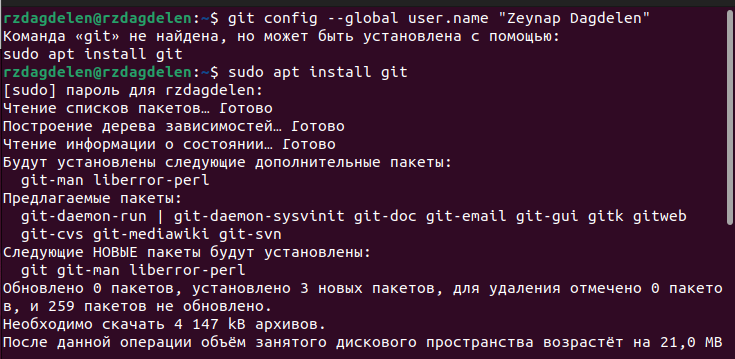{#fig:001 width=70%}

## Базовая настройка git

Зададу имя и email владельца репозитория: с помощью команд "git config --global user.name "Zeynap Dagdelen"" и "git config --global user.email "zdagdelenn@gmail.com"" (рис. 2-3).

{#fig:002 width=70%}

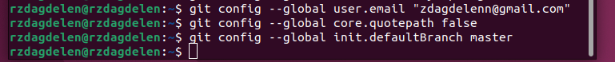{#fig:003 width=70%}

## Базовая настройка git

Настрою utf-8 в выводе сообщений git  (рис. 4).

{#fig:004 width=70%}

Зададу имя начальной ветки (будем называть её master)(рис. 5).

{#fig:005 width=70%}

## Базовая настройка git

Настроим параметры autocrlf и safecrlf (рис. 6).

{#fig:006 width=70%}

## Создание ключей ssh и pgp

Создаю ключи ssh по алгоритму ed25519 (рис. 7).

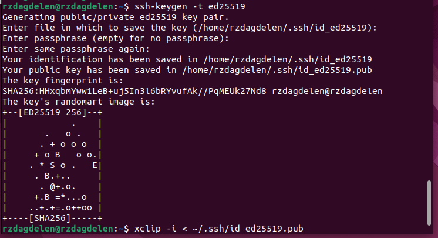{#fig:007 width=70%}

## Создание ключей ssh и pgp

Создаю ключи pgp, для этого генерирую ключ с помощью  'gpg --full-generate-key' (рис. 8).

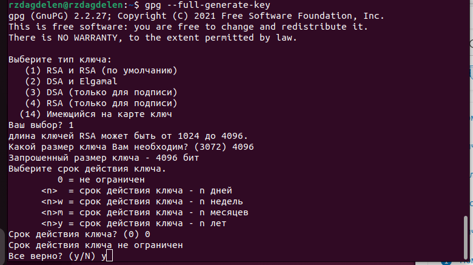{#fig:008 width=70%}

## Добавление PGP ключа в GitHub

Вывожу список ключей и копирую отпечаток приватного ключа с помощью 'gpg --list-secret-keys --keyid-format LONG' (рис. 9).

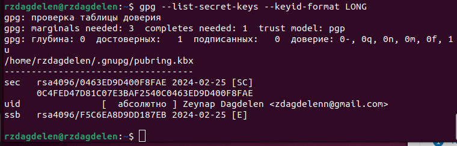{#fig:009 width=70%}

Отпечаток ключа — это последовательность байтов, используемая для идентификации более длинного, по сравнению с самим отпечатком ключа.

## Добавление PGP ключа в GitHub

Cкопирую свой сгенерированный PGP ключ в буфер обмена с помощью 'gpg --armor --export 0463ED9D400F8FAE | xclip -sel clip'(рис. 10).

{#fig:010 width=70%}

## Добавление PGP ключа в GitHub

Перехожу в настройки GitHub (https://github.com/settings/keys), нажимаю на кнопку New GPG key и вставляю полученный ключ в поле ввода (рис. 11).

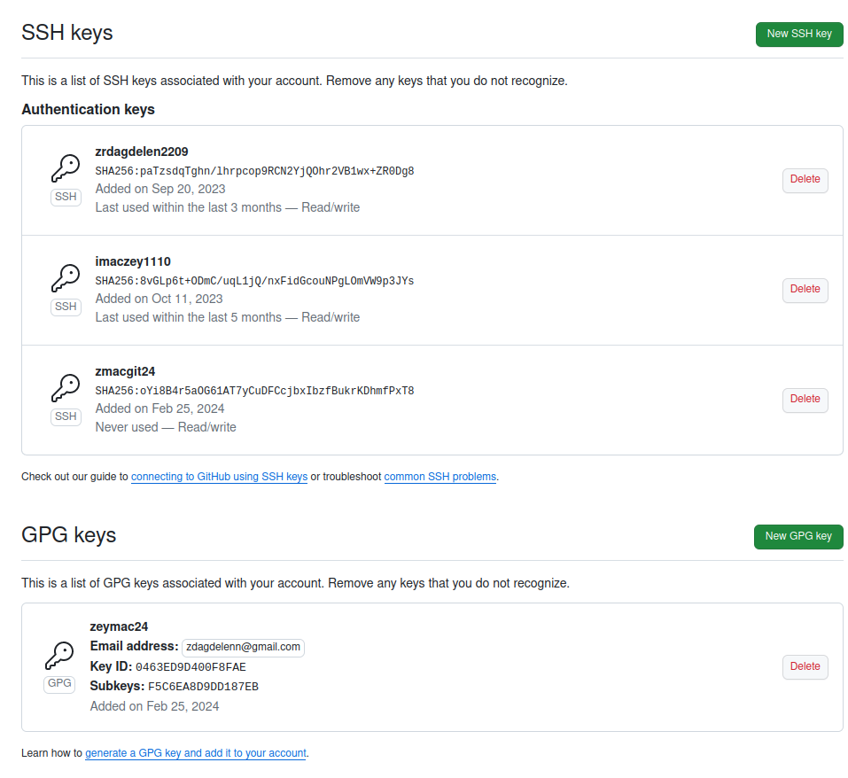{#fig:011 width=40%}

## Настройка автоматических подписей коммитов git

Используя введёный email, указываю Git применять его при подписи коммитов (рис. 12).

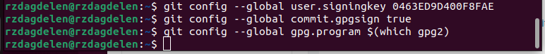{#fig:012 width=70%}

## Настройка gh

Для начала необходимо авторизоваться с помощью 'gh auth login' (рис. 13).

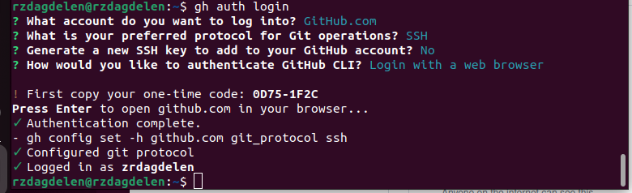{#fig:013 width=70%}

## Создание репозитория курса на основе шаблона

Необходимо создать шаблон рабочего пространства с помощью последовательности команд: (рис. 14, 15, 16).

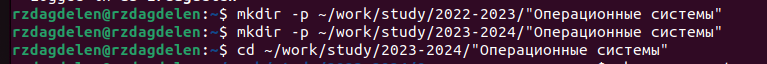{#fig:014 width=45%}

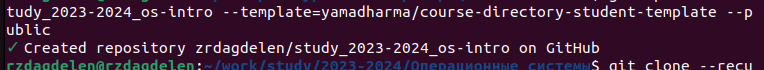{#fig:015 width=45%}

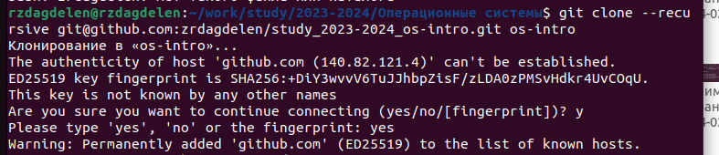{#fig:016 width=45%}

## Настройка каталога курса

Перехожу в каталог курса  спомощью cd, удаляю лишние файлы с помощью rm и создаю необходимые каталоги (рис. 17).

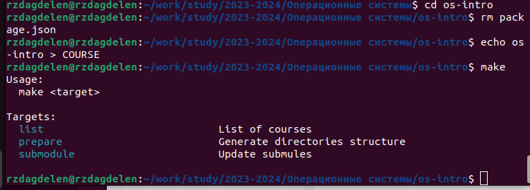{#fig:017 width=40%}

## Настройка каталога курса

Отправляю файлы на сервер (рис. 18).

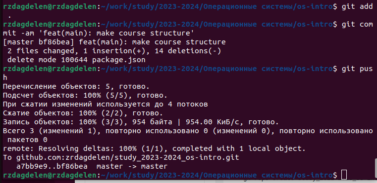{#fig:018 width=40%}

# Выводы

Я изучила идеологию и применение средств контроля версий и освоила умения по работе с git.

# Список литературы{.unnumbered}

[Операционные системы](https://esystem.rudn.ru/mod/page/view.php?id=1098790#orgc96c791)
