---
## Front matter
title: "Отчёт по лабораторной работе №2"
subtitle: "Первоначальная настройка гитхаб"
author: "Дагделен Зейнап Реджеповна"

## Generic otions
lang: ru-RU
toc-title: "Содержание"

## Bibliography
bibliography: bib/cite.bib
csl: pandoc/csl/gost-r-7-0-5-2008-numeric.csl

## Pdf output format
toc: true # Table of contents
toc-depth: 2
lof: true # List of figures
lot: true # List of tables
fontsize: 12pt
linestretch: 1.5
papersize: a4
documentclass: scrreprt
## I18n polyglossia
polyglossia-lang:
  name: russian
  options:
	- spelling=modern
	- babelshorthands=true
polyglossia-otherlangs:
  name: english
## I18n babel
babel-lang: russian
babel-otherlangs: english
## Fonts
mainfont: PT Serif
romanfont: PT Serif
sansfont: PT Sans
monofont: PT Mono
mainfontoptions: Ligatures=TeX
romanfontoptions: Ligatures=TeX
sansfontoptions: Ligatures=TeX,Scale=MatchLowercase
monofontoptions: Scale=MatchLowercase,Scale=0.9
## Biblatex
biblatex: true
biblio-style: "gost-numeric"
biblatexoptions:
  - parentracker=true
  - backend=biber
  - hyperref=auto
  - language=auto
  - autolang=other*
  - citestyle=gost-numeric
## Pandoc-crossref LaTeX customization
figureTitle: "Рис."
tableTitle: "Таблица"
listingTitle: "Листинг"
lofTitle: "Список иллюстраций"
lotTitle: "Список таблиц"
lolTitle: "Листинги"
## Misc options
indent: true
header-includes:
  - \usepackage{indentfirst}
  - \usepackage{float} # keep figures where there are in the text
  - \floatplacement{figure}{H} # keep figures where there are in the text
---

# Цель работы

1) Изучить идеологию и применение средств контроля версий.
2) Освоить умения по работе с git.

# Задание
1) Установка программного обеспечения
2) Базовая настройка git
3) Создание ключей ssh и pgp
4) Настройка github
5) Добавление PGP ключа в GitHub
6) Настройка автоматических подписей коммитов git
7) Настройка gh
8) Шаблон для рабочего пространства

# Теоретическое введение

## Системы контроля версий. Общие понятия

*Системы контроля версий (Version Control System, VCS)* применяются при работе нескольких человек над одним проектом. Обычно основное дерево проекта хранится в локальном или удалённом репозитории, к которому настроен доступ для участников проекта. При внесении изменений в содержание проекта система контроля версий позволяет их фиксировать, совмещать изменения, произведённые разными участниками проекта, производить откат к любой более ранней версии проекта, если это требуется.

В классических системах контроля версий используется централизованная модель, предполагающая наличие единого репозитория для хранения файлов. Выполнение большинства функций по управлению версиями осуществляется специальным сервером. Участник проекта (пользователь) перед началом работы посредством определённых команд получает нужную ему версию файлов. После внесения изменений, пользователь размещает новую версию в хранилище. При этом предыдущие версии не удаляются из центрального хранилища и к ним можно вернуться в любой момент. Сервер может сохранять не полную версию изменённых файлов, а производить так называемую дельта-компрессию — сохранять только изменения между последовательными версиями, что позволяет уменьшить объём хранимых данных.

Системы контроля версий поддерживают возможность отслеживания и разрешения конфликтов, которые могут возникнуть при работе нескольких человек над одним файлом. Можно объединить (слить) изменения, сделанные разными участниками (автоматически или вручную), вручную выбрать нужную версию, отменить изменения вовсе или заблокировать файлы для изменения. В зависимости от настроек блокировка не позволяет другим пользователям получить рабочую копию или препятствует изменению рабочей копии файла средствами файловой системы ОС, обеспечивая таким образом, привилегированный доступ только одному пользователю, работающему с файлом.

Системы контроля версий также могут обеспечивать дополнительные, более гибкие функциональные возможности. Например, они могут поддерживать работу с несколькими версиями одного файла, сохраняя общую историю изменений до точки ветвления версий и собственные истории изменений каждой ветви. Кроме того, обычно доступна информация о том, кто из участников, когда и какие изменения вносил. Обычно такого рода информация хранится в журнале изменений, доступ к которому можно ограничить.

В отличие от классических, в распределённых системах контроля версий центральный репозиторий не является обязательным.

Среди классических VCS наиболее известны CVS, Subversion, а среди распределённых — Git, Bazaar, Mercurial. Принципы их работы схожи, отличаются они в основном синтаксисом используемых в работе команд.

## Примеры использования git

- Система контроля версий Git представляет собой набор программ командной строки. Доступ к ним можно получить из терминала посредством ввода команды git с различными опциями.
- Благодаря тому, что Git является распределённой системой контроля версий, резервную копию локального хранилища можно сделать простым копированием или архивацией.

## Основные команды git

Перечислим наиболее часто используемые команды git.

- Создание основного дерева репозитория: git init

- Получение обновлений (изменений) текущего дерева из центрального репозитория: git pull

- Отправка всех произведённых изменений локального дерева в центральный репозиторий: git push

- Просмотр списка изменённых файлов в текущей директории: git status

и тд.

# Выполнение лабораторной работы

## Установка программного обеспечения

### Установка git

Установлю git(рис. [-@fig:001]).

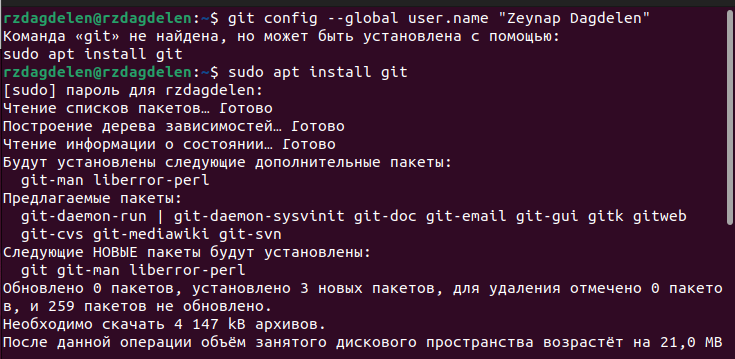{#fig:001 width=70%}

## Базовая настройка git

Зададу имя и email владельца репозитория: с помощью команд "git config --global user.name "Zeynap Dagdelen"" и "git config --global user.email "zdagdelenn@gmail.com"" (рис. [-@fig:002]- [-@fig:003]).

{#fig:002 width=70%}

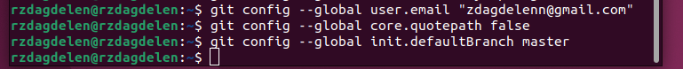{#fig:003 width=70%}

Настрою utf-8 в выводе сообщений git  (рис. [-@fig:004]).

{#fig:004 width=70%}

Зададу имя начальной ветки (будем называть её master)(рис. [-@fig:005]).

{#fig:005 width=70%}

Настроим параметры autocrlf и safecrlf (рис. [-@fig:006]).

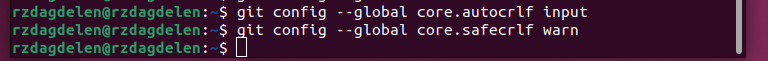{#fig:006 width=70%}

## Создание ключей ssh и pgp

Создаю ключи ssh по алгоритму ed25519 (рис. [-@fig:007]).

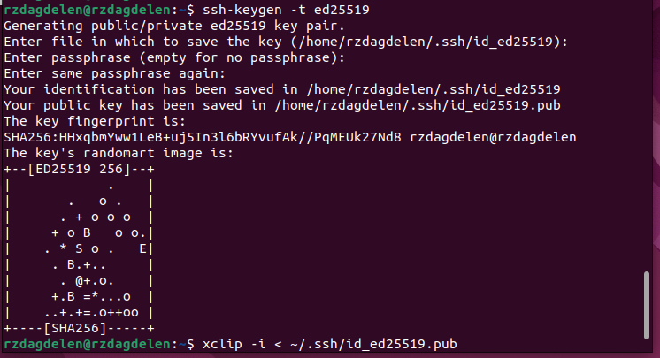{#fig:007 width=70%}

Создаю ключи pgp, для этого генерирую ключ с помощью  'gpg --full-generate-key' (рис. [-@fig:008]).

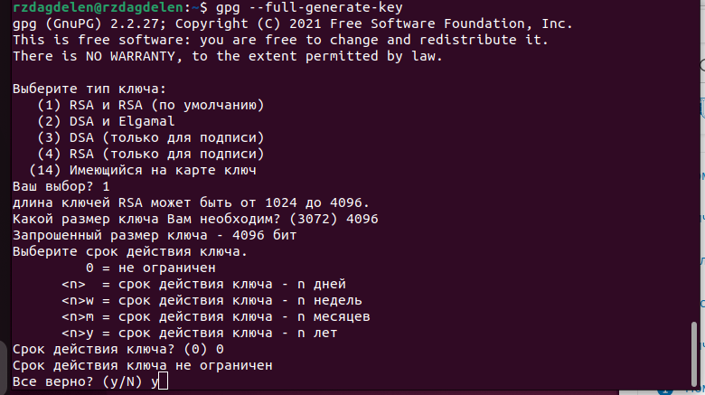{#fig:008 width=70%}

## Настройка github

Я создала учётную запись на https://github.com и заполнила основные данные на https://github.com (в прошлом курсе).

## Добавление PGP ключа в GitHub

Вывожу список ключей и копирую отпечаток приватного ключа с помощью 'gpg --list-secret-keys --keyid-format LONG' (рис. [-@fig:009]).

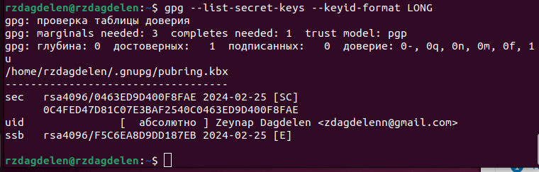{#fig:009 width=70%}

Отпечаток ключа — это последовательность байтов, используемая для идентификации более длинного, по сравнению с самим отпечатком ключа.

Cкопирую свой сгенерированный PGP ключ в буфер обмена с помощью 'gpg --armor --export 0463ED9D400F8FAE | xclip -sel clip'(рис. [-@fig:010]).

{#fig:010 width=70%}

Перехожу в настройки GitHub (https://github.com/settings/keys), нажимаю на кнопку New GPG key и вставляю полученный ключ в поле ввода (рис. [-@fig:011]).

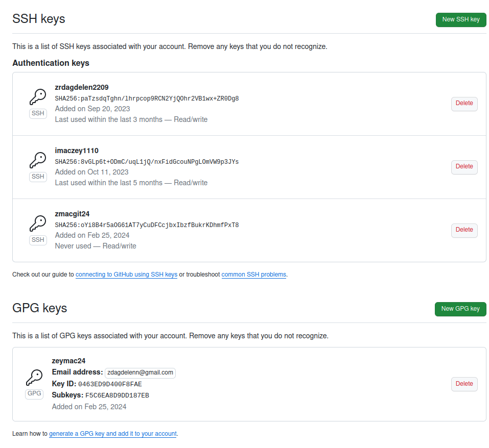{#fig:011 width=70%}

## Настройка автоматических подписей коммитов git

Используя введёный email, указываю Git применять его при подписи коммитов (рис. [-@fig:012]).

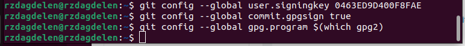{#fig:012 width=70%}

## Настройка gh

Для начала необходимо авторизоваться с помощью 'gh auth login' (рис. [-@fig:013]).

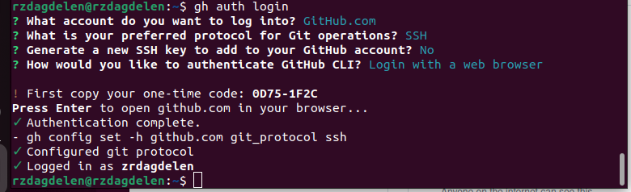{#fig:013 width=70%}

## Создание репозитория курса на основе шаблона

Необходимо создать шаблон рабочего пространства с помощью последовательности команд: (рис. [-@fig:014], [-@fig:015],[-@fig:016]).

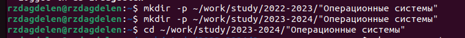{#fig:014 width=70%}

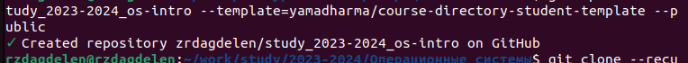{#fig:015 width=70%}

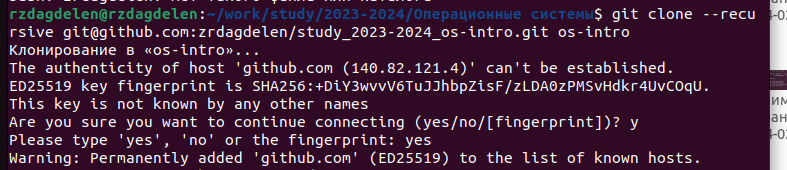{#fig:016 width=70%}

## Настройка каталога курса

Перехожу в каталог курса  спомощью cd, удаляю лишние файлы с помощью rm и создаю необходимые каталоги (рис. [-@fig:017]).

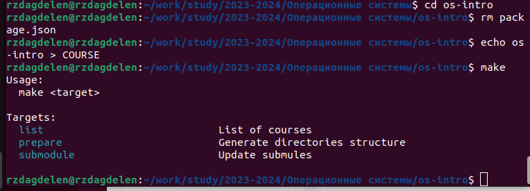{#fig:017 width=70%}

Отправляю файлы на сервер (рис. [-@fig:018]).

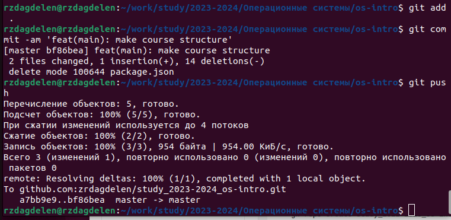{#fig:018 width=70%}

# Ответы на контрольные вопросы.

1) Система контроля версий (VCS) - это программное обеспечение, которое позволяет отслеживать изменения в документах и проектах, при необходимости производить их откат, сохранять историю изменений, а также управлять параллельной разработкой кода несколькими участниками.
2) Хранилище (repository) - это специальное хранилище файлов и папок проекта, изменения в которых отслеживаются. Коммит (commit) - это процесс сохранения изменений в хранилище. История (history) - это полная хронология изменений в коде. Рабочая копия (working copy) - это местная копия кода, которая находится на компьютере разработчика перед тем, как она будет сохранена в хранилище.
3) Централизованные VCS используют один общедоступный сервер хранилища, через который производятся все изменения. Децентрализованные VCS позволяют каждой копии хранилища быть независимой и автономной, изменения могут быть синхронизированы между копиями хранилища, но не требуют участия центрального сервера. Примеры централизованных VCS: CVS, SVN. Примеры децентрализованных VCS: Git, Mercurial.
4) При единоличной работе с хранилищем действия с VCS включают клонирование репозитория на локальную машину, создание изменений в рабочей копии и коммит изменений в хранилище.
5) Порядок работы с общим хранилищем VCS включает клонирование репозитория на локальную машину, создание изменений в рабочей копии, коммит изменений в локальный репозиторий, отправку изменений в удаленный репозиторий и слияние изменений с другими ветками.
6) Основные задачи, решаемые инструментальным средством Git, включают управление версиями, управление ветвлением, управление изменениями, управление конфликтами и управление совместной работой.
7) Некоторые команды Git и их краткая характеристика: git init - создание нового репозитория, git add - добавление изменений в индекс,git commit - сохранение изменений в репозитории, git push - отправка изменений в удаленный репозиторий, git pull - получение изменений из удаленного репозитория,git branch - создание, удаление и переключение веток, git merge - слияние изменений из других веток.
8) Примеры использования при работе с локальным и удаленным репозиториями включают создание нового репозитория с помощью команды git init, клонирование удаленного репозитория с помощью команды git clone, отправку изменений в удаленный репозиторий с помощью команды git push и получение изменений из удаленного репозитория с помощью команды git pull.
9) Ветви (branches) - это механизм, который позволяет создавать отдельные ветки разработки, которые могут быть объединены в основную ветку позже. Ветви могут быть использованы для разработки новых функций, исправления ошибок и тестирования кода.
10) Для игнорирования некоторых файлов при коммите можно использовать файл .gitignore, в котором перечисляются имена файлов и папок, которые не должны быть добавлены в репозиторий. Файлы и папки, указанные в .gitignore, будут проигнорированы при коммите.

# Выводы

Я изучила идеологию и применение средств контроля версий и освоила умения по работе с git.

# Список литературы{.unnumbered}

[Операционные системы](https://esystem.rudn.ru/mod/page/view.php?id=1098790#orgc96c791)

