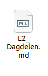
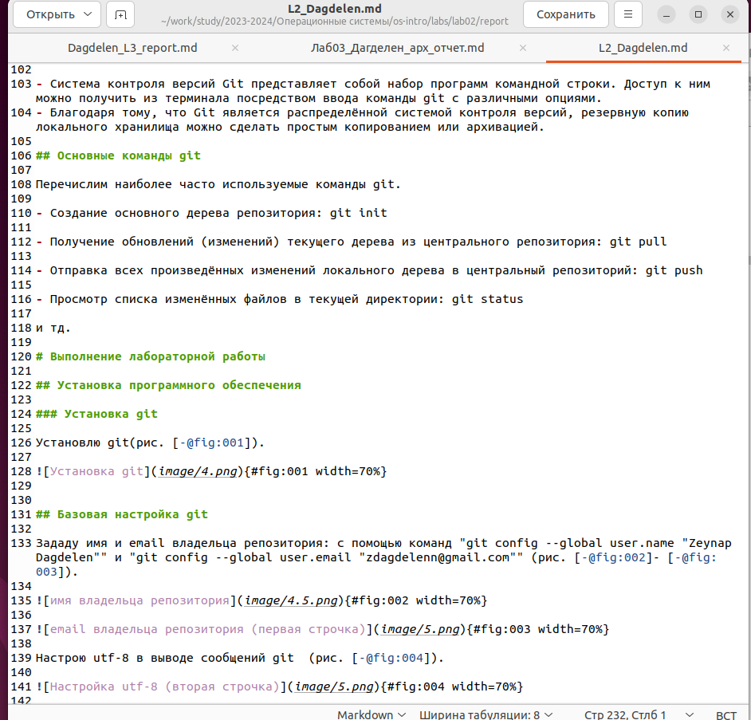
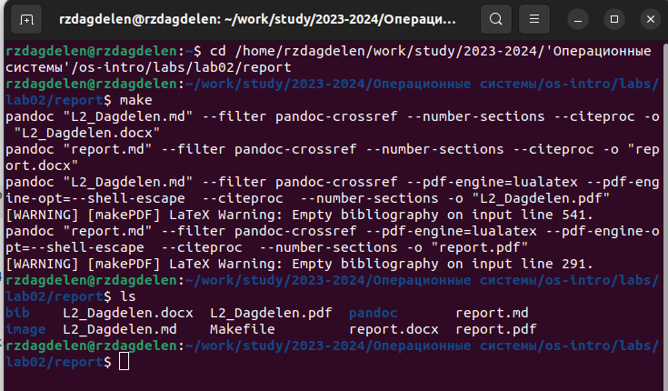
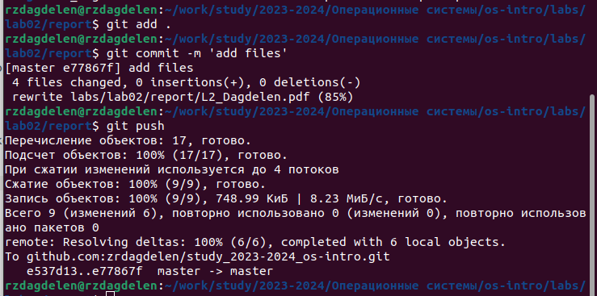

---
## Front matter
lang: ru-RU
title: Лабораторная работа №3
subtitle: Markdown
author:
  - Дагделен З. Р.
institute:
  - Российский университет дружбы народов, Москва, Россия
date: 29 февраля 2024

## i18n babel
babel-lang: russian
babel-otherlangs: english

## Formatting pdf
toc: false
toc-title: Содержание
slide_level: 2
aspectratio: 169
section-titles: true
theme: metropolis
header-includes:
 - \metroset{progressbar=frametitle,sectionpage=progressbar,numbering=fraction}
 - '\makeatletter'
 - '\beamer@ignorenonframefalse'
 - '\makeatother'
---
# Вводная часть

## Цели работы

Научиться оформлять отчёты с помощью легковесного языка разметки Markdown.

## Задание

Создание отчета ко второй лаборатоной работе

# Выполнение лабораторной работы.

## Создание отчета ко второй лаборатоной работе

Для удобства копирую файл report.mg с другим именем (L2_Dagdelen.md) (рис. 1).

{#fig:001 width=30%}

## Создание отчета ко второй лаборатоной работе

Открываю файл и начинаю заполнять отчет (рис. 2).

{#fig:002 width=30%}

## Создание отчета ко второй лаборатоной работе
Компилирую файл с отчетом по лаб.работе, заранее перейдя в нужный каталог, в которой нужно скомпилировать файл с помощью cd(рис. 3).

{#fig:003 width=30%}

## Создание отчета ко второй лаборатоной работе

Добавляю изменения на GitHub с помощью git add и сохраняю изменения с помощью commit и наконец, отправляю файлы на сервер с помощью команды git push (рис. 4).

{#fig:004 width=30%}

# Выводы

Я научилась оформлять отчёты с помощью легковесного языка разметки Markdown.

# Список литературы{.unnumbered}

[Операционные системы](https://esystem.rudn.ru/pluginfile.php/2288079/mod_resource/content/3/003-lab_markdown.pdf)
