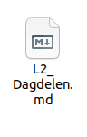
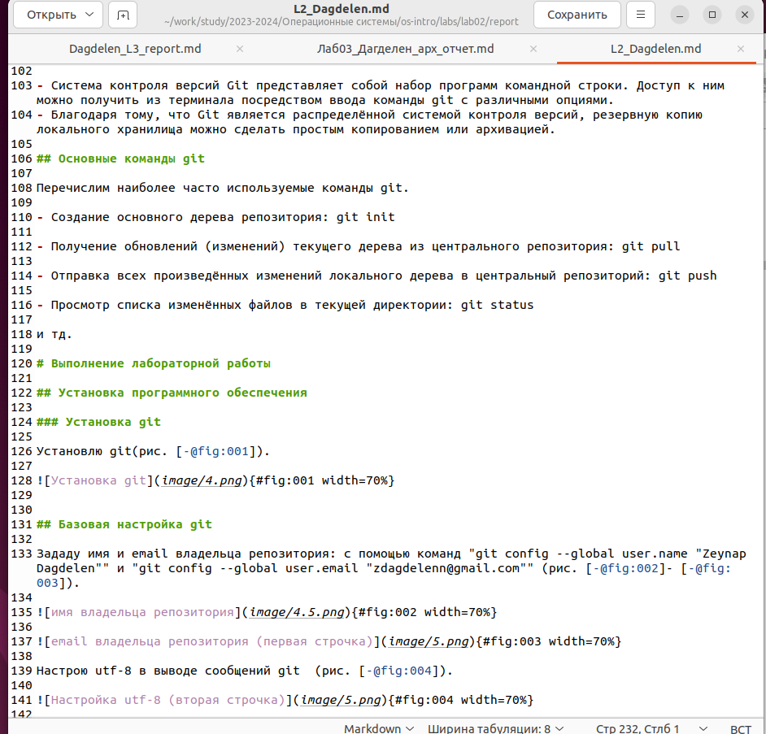
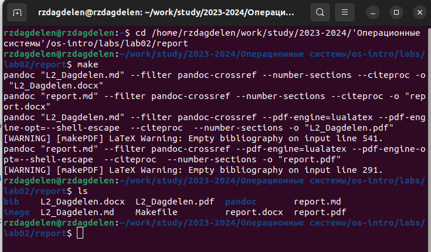
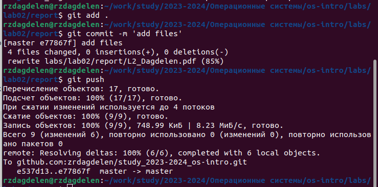

---
## Front matter
title: "Отчет по лабораторной работе №3"
subtitle: "Markdown"
author: "Дагделен Зейнап Реджеповна"

## Generic otions
lang: ru-RU
toc-title: "Содержание"

## Bibliography
bibliography: bib/cite.bib
csl: pandoc/csl/gost-r-7-0-5-2008-numeric.csl

## Pdf output format
toc: true # Table of contents
toc-depth: 2
lof: true # List of figures
lot: true # List of tables
fontsize: 12pt
linestretch: 1.5
papersize: a4
documentclass: scrreprt
## I18n polyglossia
polyglossia-lang:
  name: russian
  options:
	- spelling=modern
	- babelshorthands=true
polyglossia-otherlangs:
  name: english
## I18n babel
babel-lang: russian
babel-otherlangs: english
## Fonts
mainfont: PT Serif
romanfont: PT Serif
sansfont: PT Sans
monofont: PT Mono
mainfontoptions: Ligatures=TeX
romanfontoptions: Ligatures=TeX
sansfontoptions: Ligatures=TeX,Scale=MatchLowercase
monofontoptions: Scale=MatchLowercase,Scale=0.9
## Biblatex
biblatex: true
biblio-style: "gost-numeric"
biblatexoptions:
  - parentracker=true
  - backend=biber
  - hyperref=auto
  - language=auto
  - autolang=other*
  - citestyle=gost-numeric
## Pandoc-crossref LaTeX customization
figureTitle: "Рис."
tableTitle: "Таблица"
listingTitle: "Листинг"
lofTitle: "Список иллюстраций"
lotTitle: "Список таблиц"
lolTitle: "Листинги"
## Misc options
indent: true
header-includes:
  - \usepackage{indentfirst}
  - \usepackage{float} # keep figures where there are in the text
  - \floatplacement{figure}{H} # keep figures where there are in the text
---

# Цель работы

Научиться оформлять отчёты с помощью легковесного языка разметки Markdown.

# Задание

Создание отчета ко второй лаборатоной работе 

# Теоретическое введение

##Базовые сведения о Markdown.

Чтобы создать заголовок, нужно использовать знак # (например: # This is heading 1). Чтобы задать для текста полужирное начертание, необходимо заключить его в двойные звездочки (This text is **bold**). Чтобы задать для текста курсивное начертание, нужно заключить его в одинарные звездочки (This text is *italic*). Чтобы задать для текста полужирное и курсивное начертание, необходимо заключить его в тройные звездочки (This is text is both ***bold and italic***).
## Цитирование и списки в MarkDown.

Блоки цитирования создаются с помощью символа >.
Упорядоченный список можно отформатировать с помощью соответствующих цифр. Чтобы вложить один список в другой, нужно добавить отступ для элементов дочернего списка. Неупорядоченный (маркированный) список можно отформатировать с помощью звездочек или тире.
Синтаксис Markdown для встроенной ссылки состоит из части, представляющей текст гиперссылки, и части (file-name.md) – URL-адреса или имени файла, на который дается ссылка.
Markdown поддерживает как встраивание фрагментов кода в предложение, так и их размещение между предложениями в виде отдельных огражденных блоков. Огражденные блоки кода — это простой способ выделить синтаксис для фрагментов кода. 

##Оформление формул в Markdown.

Внутритекстовые формулы делаются аналогично формулам LaTeX. 

##Оформление изображений в Markdown.

В Markdown вставить изображение в документ можно с помощью непосредственного
указания адреса изображения. 
Здесь:
- в квадратных скобках указывается подпись к изображению;
- в круглых скобках указывается URL-адрес или относительный путь изображения, а также (необязательно) всплывающую подсказку, заключённую в двойные или одиночные кавычки.
- в фигурных скобках указывается идентификатор изображения (#fig:fig1) для ссылки
на него по тексту и размер изображения относительно ширины страницы (width=90%)

# Выполнение лабораторной работы

##Создание отчета ко второй лаборатоной работе 

Для удобства копирую файл report.mg с другим именем (L2_Dagdelen.md) (рис. [-@fig:001]).

{#fig:001 width=70%}

Открываю файл и начинаю заполнять отчет (рис. [-@fig:002]).

{#fig:002 width=70%}

Компилирую файл с отчетом по лаб.работе, заранее перейдя в нужный каталог, в которой нужно скомпилировать файл с помощью cd(рис. [-@fig:003]).

{#fig:003 width=70%}

Добавляю изменения на GitHub с помощью git add и сохраняю изменения с помощью commit и наконец, отправляю файлы на сервер с помощью команды git push (рис. [-@fig:004]).

{#fig:004 width=70%}

# Выводы

Я научилась оформлять отчёты с помощью легковесного языка разметки Markdown.

# Список литературы

[Операционные системы](https://esystem.rudn.ru/pluginfile.php/2288079/mod_resource/content/3/003-lab_markdown.pdf)
