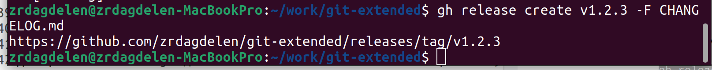

---
## Front matter
lang: ru-RU
title: Лабораторная работа №4
subtitle: Продвинутое использование git
author:
  - Дагделен З. Р.
institute:
  - Российский университет дружбы народов, Москва, Россия
date: 9 марта 2024

## i18n babel
babel-lang: russian
babel-otherlangs: english

## Formatting pdf
toc: false
toc-title: Содержание
slide_level: 2
aspectratio: 169
section-titles: true
theme: metropolis
header-includes:
 - \metroset{progressbar=frametitle,sectionpage=progressbar,numbering=fraction}
 - '\makeatletter'
 - '\beamer@ignorenonframefalse'
 - '\makeatother'
---
# Вводная часть

## Цели работы

Получение навыков правильной работы с репозиториями git.

## Задание

1. Установка программного обеспечения
	- Установка git-flow
	- Установка Node.js
	- Настройка Node.js
	- Общепринятые коммиты

# Выполнение лабораторной работы.

## Установка программного обеспечения. Установка git-flow

Так как у меня Ubuntu, то команды различаются. Установлю git-flow (рис. 1).

{#fig:001 width=30%}

## Установка программного обеспечения. Установка Node.js

Обновляю список пакетов и устанавливаю Node.js (рис. 2)

{#fig:002 width=30%}

## Установка программного обеспечения. Установка Node.js

Устанавливаю npm(рис. 3)

{#fig:003 width=30%}
 
## Установка программного обеспечения. Установка Node.js

проверяю установку (рис. 4).

{#fig:004 width=30%}

## Установка программного обеспечения. Установка Node.js

Устанавливаю PNPM глобально на своей системе (рис. 5).

{#fig:005 width=30%}

## Установка программного обеспечения. Настройка Node.js

Для работы с Node.js добавляю каталог с исполняемыми файлами, устанавливаемыми yarn, в переменную PATH (рис. 6). Запускаю pnpm setup и выполняю source ~/.bashrc  (рис. 7).

{#fig:006 width=30%}

{#fig:007 width=30%}

## Установка программного обеспечения. Общепринятые коммиты

Выполняю команду pnpm add -g commitizen (рис. 8).
	
{#fig:008 width=30%}

## Установка программного обеспечения. Общепринятые коммиты

Выполняю pnpm add -g standard-changelog (рис. 9).
	
{#fig:009 width=30%}

## Установка программного обеспечения. Общепринятые коммиты

Создаю репозиторий на GitHub. Назову его git-extended (рис. 10).
			
{#fig:010 width=30%}

## Установка программного обеспечения. Общепринятые коммиты

Делаю первый коммит и выкладываю на github с помощью последовательности команд (рис. 11).
			
{#fig:012 width=30%}

## Установка программного обеспечения. Общепринятые коммиты

Конфигурация для пакетов Node.js с помощью pnpm init (рис. 12).
			
{#fig:013 width=30%}

## Установка программного обеспечения. Общепринятые коммиты

Меняю файл package.json таким образом, чтобы он приобрел нужный вид. Добавляю новые файлы, выполняю коммит и отправляю на github  (рис. 13 - рис. 14).
			
{#fig:015 width=30%}
			
{#fig:016 width=30%}

## Установка программного обеспечения. Общепринятые коммиты

Инициализирую git-flow(рис. 15). 
			
{#fig:017 width=30%}

 Проверяю, что нахожусь на ветке develop (рис. 16).
			
{#fig:018 width=30%}

## Установка программного обеспечения. Общепринятые коммиты

Загружаю весь репозиторий в хранилище (рис. 17).
			
{#fig:019 width=30%}

Устанавливаю внешнюю ветку как вышестоящую для этой ветки и создаю релиз с версией 1.0.0  (рис. 18).
			
{#fig:020 width=30%}

## Установка программного обеспечения. Общепринятые коммиты

-Создаю журнал изменений (standard-changelog --first-release) (рис. 19).
			
{#fig:021 width=30%}

Добавляю журнал изменений в индекс и заливаю релизную ветку в основную ветку (рис. 20).
			
{#fig:022 width=30%}

## Установка программного обеспечения. Общепринятые коммиты

Отправляю данные на github (рис. 21).
			
{#fig:023 width=30%}

## Установка программного обеспечения. Общепринятые коммиты

Создаю релиз на github. Для этого буду использовать утилиты работы с github (рис. 22).
			
{#fig:024 width=30%}

## Установка программного обеспечения. Общепринятые коммиты

Создаю ветку для новой функциональности (рис. 23).
				
{#fig:025 width=30%}

Объединяю ветку feature branch c develop (рис. 24).
    				
{#fig:026 width=30%}

## Установка программного обеспечения. Общепринятые коммиты

 Создаю релиз с версией 1.2.3 (рис. 25).
    				
{#fig:027 width=30%}

Обновляю номер версии в файле package.json. Устанавливаю её в 1.2.3. (рис. 26).
    				
{#fig:028 width=30%}

## Установка программного обеспечения. Общепринятые коммиты

Создаю журнал изменений (рис. 27).
    				
{#fig:029 width=30%}

## Установка программного обеспечения. Общепринятые коммиты

Добавляю журнал изменений в индекс (рис. 28).
    				
{#fig:030 width=30%}

## Установка программного обеспечения. Общепринятые коммиты

Залью релизную ветку в основную ветку (рис. 29).
    				
{#fig:031 width=30%}

## Установка программного обеспечения. Общепринятые коммиты

Отправляю данные на github (рис. 30).
    				
{#fig:032 width=30%}

## Установка программного обеспечения. Общепринятые коммиты

Создадим релиз на github с комментарием из журнала изменений (рис. 31).
    				
{#fig:033 width=30%}

# Выводы

Я получила навыки правильной работы с репозиториями git.

# Список литературы{.unnumbered}

[Операционные системы](https://esystem.rudn.ru/mod/page/view.php?id=1098794)
