---
## Front matter
title: "Отчет по лабораторной работе №4"
subtitle: "Продвинутое использование git."
author: "Дагделен Зейнап Реджеповна"

## Generic otions
lang: ru-RU
toc-title: "Содержание"

## Bibliography
bibliography: bib/cite.bib
csl: pandoc/csl/gost-r-7-0-5-2008-numeric.csl

## Pdf output format
toc: true # Table of contents
toc-depth: 2
lof: true # List of figures
lot: true # List of tables
fontsize: 12pt
linestretch: 1.5
papersize: a4
documentclass: scrreprt
## I18n polyglossia
polyglossia-lang:
  name: russian
  options:
	- spelling=modern
	- babelshorthands=true
polyglossia-otherlangs:
  name: english
## I18n babel
babel-lang: russian
babel-otherlangs: english
## Fonts
mainfont: PT Serif
romanfont: PT Serif
sansfont: PT Sans
monofont: PT Mono
mainfontoptions: Ligatures=TeX
romanfontoptions: Ligatures=TeX
sansfontoptions: Ligatures=TeX,Scale=MatchLowercase
monofontoptions: Scale=MatchLowercase,Scale=0.9
## Biblatex
biblatex: true
biblio-style: "gost-numeric"
biblatexoptions:
  - parentracker=true
  - backend=biber
  - hyperref=auto
  - language=auto
  - autolang=other*
  - citestyle=gost-numeric
## Pandoc-crossref LaTeX customization
figureTitle: "Рис."
tableTitle: "Таблица"
listingTitle: "Листинг"
lofTitle: "Список иллюстраций"
lotTitle: "Список таблиц"
lolTitle: "Листинги"
## Misc options
indent: true
header-includes:
  - \usepackage{indentfirst}
  - \usepackage{float} # keep figures where there are in the text
  - \floatplacement{figure}{H} # keep figures where there are in the text
---

# Цель работы

Получение навыков правильной работы с репозиториями git.

# Задание

1. Установка программного обеспечения
	- Установка git-flow
	- Установка Node.js
	- Настройка Node.js
	- Общепринятые коммиты

# Теоретическое введение

## Рабочий процесс Gitflow

Рабочий процесс Gitflow Workflow. Будем описывать его с использованием пакета git-flow.

## Общая информация

- Gitflow Workflow опубликована и популяризована Винсентом Дриссеном.
- Gitflow Workflow предполагает выстраивание строгой модели ветвления с учётом выпуска проекта.
- Данная модель отлично подходит для организации рабочего процесса на основе релизов.
- Работа по модели Gitflow включает создание отдельной ветки для исправлений ошибок в рабочей среде.
-Последовательность действий при работе по модели Gitflow:
        - Из ветки master создаётся ветка develop.
        - Из ветки develop создаётся ветка release.
        - Из ветки develop создаются ветки feature.
        - Когда работа над веткой feature завершена, она сливается с веткой develop.
        - Когда работа над веткой релиза release завершена, она сливается в ветки develop и master.
        - Если в master обнаружена проблема, из master создаётся ветка hotfix.
        - Когда работа над веткой исправления hotfix завершена, она сливается в ветки develop и master.
## Краткое описание семантического версионирования

Семантическое версионирование описывается в (манифесте семантического версионирования)[https://semver.org/lang/ru/].

## Программное обеспечение

- Для реализации семантического версионирования создано несколько программных продуктов.
- При этом лучше всего использовать комплексные продукты, которые используют информацию из коммитов системы версионирования.
- Коммиты должны иметь стандартизованный вид.
- В семантическое версионирование применяется вместе с общепринятыми коммитами.

# Выполнение лабораторной работы

## Установка программного обеспечения

### Установка git-flow

Так как у меня Ubuntu, то команды различаются. Установлю git-flow с помощью ... (рис. [-@fig:001]).

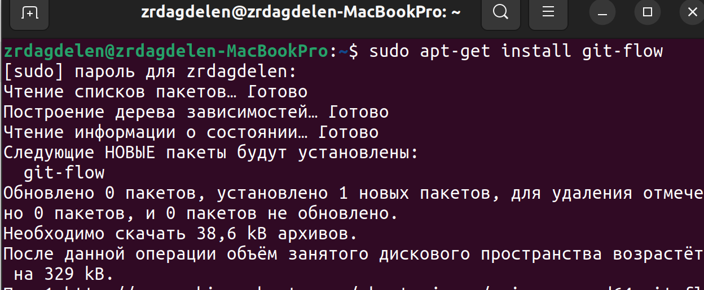{#fig:001 width=70%}

### Установка Node.js

На Node.js базируется программное обеспечение для семантического версионирования и общепринятых коммитов. Для Ubuntu выполняем последовательность команд: обновляю список пакетов (sudo apt update) и устанавливаю Node.js (sudo apt install nodejs) (рис. [-@fig:002]), устанавливаю npm (sudo apt install npm)(рис. [-@fig:003]), проверяю установку (node -v; npm -v) (рис. [-@fig:004]).

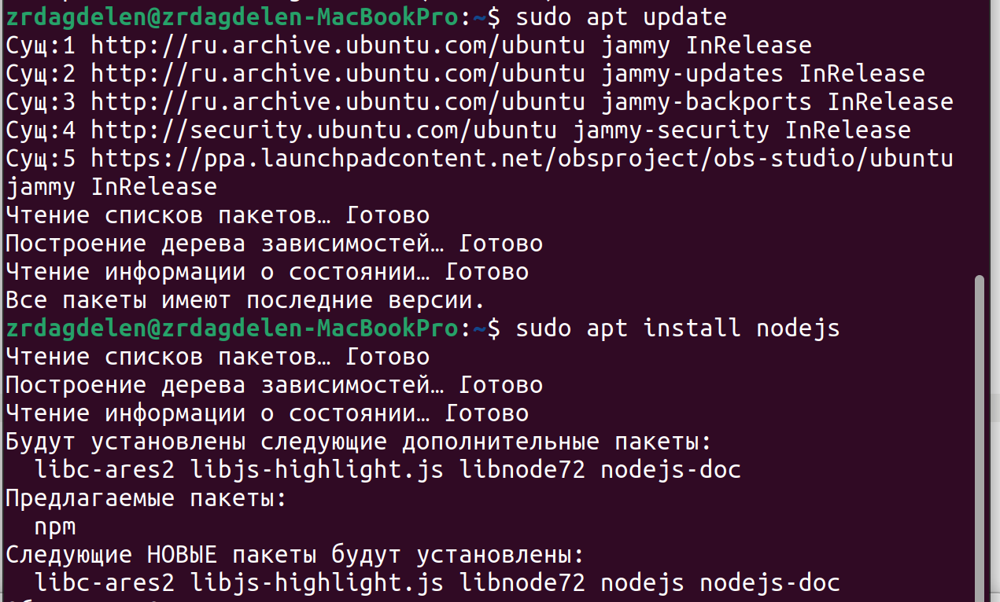{#fig:002 width=70%}

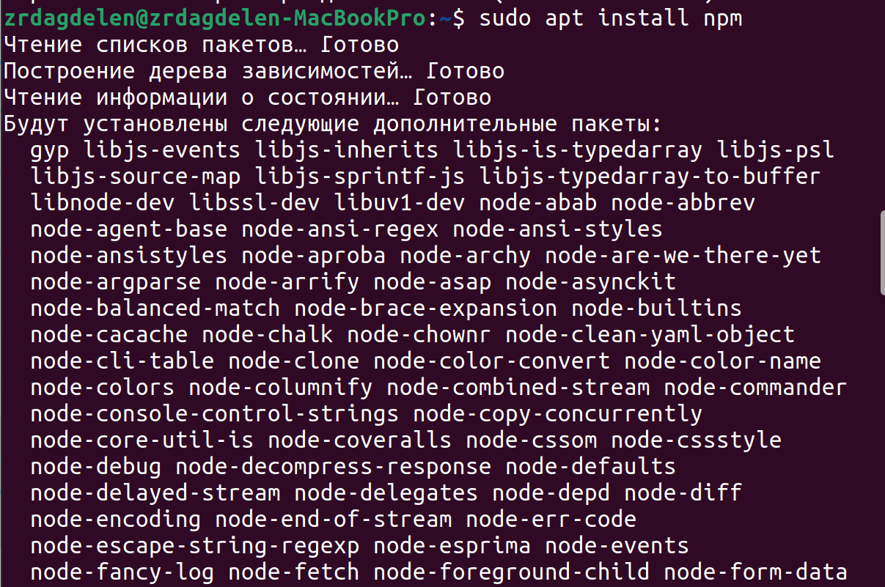{#fig:003 width=70%}

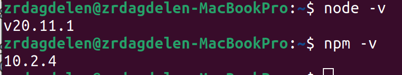{#fig:004 width=70%}

Устанавливаю PNPM глобально на своей системе с помощью команды (sudo npm install -g pnpm) (рис. [-@fig:005]).

{#fig:005 width=70%}

### Настройка Node.js

Для работы с Node.js добавляю каталог с исполняемыми файлами, устанавливаемыми yarn, в переменную PATH (рис. [-@fig:006]). Запускаю pnpm setup и выполняю source ~/.bashrc  (рис. [-@fig:007]).

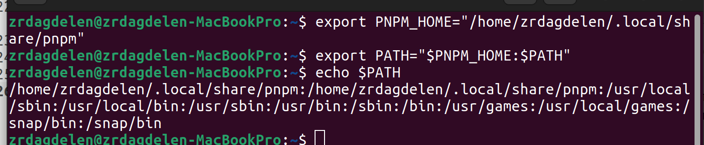{#fig:006 width=70%}

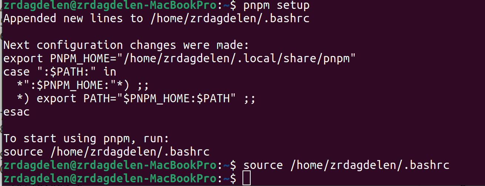{#fig:007 width=70%}

### Общепринятые коммиты

1. commitizen
	- Данная программа используется для помощи в форматировании коммитов. При этом устанавливается скрипт git-cz, который я буду использовать для коммитов. Выполняю команду pnpm add -g commitizen (рис. [-@fig:008]).
	
	{#fig:008 width=70%}

2. standard-changelog

	- Данная программа используется для помощи в создании логов. Выполняю pnpm add -g standard-changelog (рис. [-@fig:009]).
	
	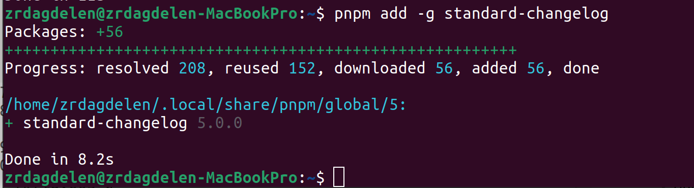{#fig:009 width=70%}

3. Практический сценарий использования git
	1. Создание репозитория git
		1. Подключение репозитория к github
			- Создаю репозиторий на GitHub. Назову его git-extended (рис. [-@fig:010]).
			
			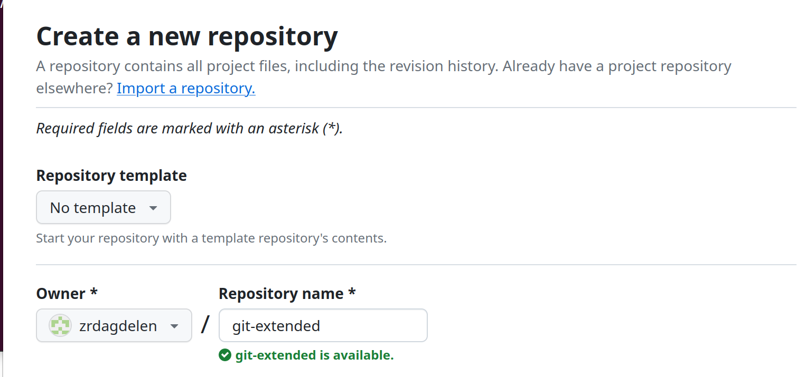{#fig:010 width=70%}
			
			- Перехожу в папку work с помощью cd и клонирую репозиторий из GitHub себе в домашнюю папку, после перемещаюсь в образовавшуюся папку git-extended (рис. [-@fig:011]).
			
			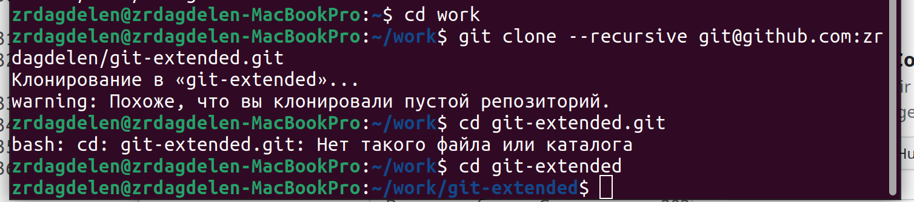{#fig:011 width=70%}
			
			- Делаю первый коммит и выкладываю на github с помощью последовательности команд (рис. [-@fig:012]).
			
			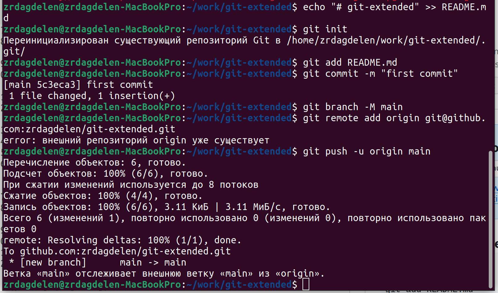{#fig:012 width=70%}

		2. Конфигурация общепринятых коммитов

    			- Конфигурация для пакетов Node.js с помощью pnpm init (рис. [-@fig:013]).
			
			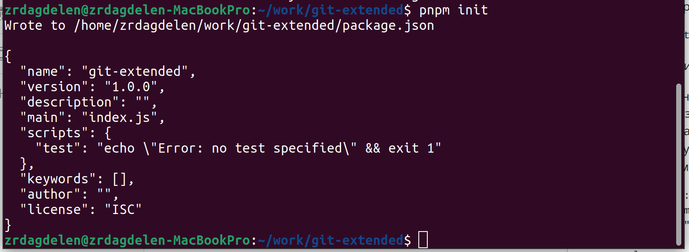{#fig:013 width=70%}
			
			Заполняю несколько параметров пакета: 1)Название пакета, 2) Лицензия пакета (выбираю лицензию CC-BY-4.0)
			Сконфигурирую формат коммитов. Для этого добавляю в файл package.json команду для формирования коммитов. Таким образом, файл package.json приобретает нужный вид (рис. [-@fig:014]).
			
			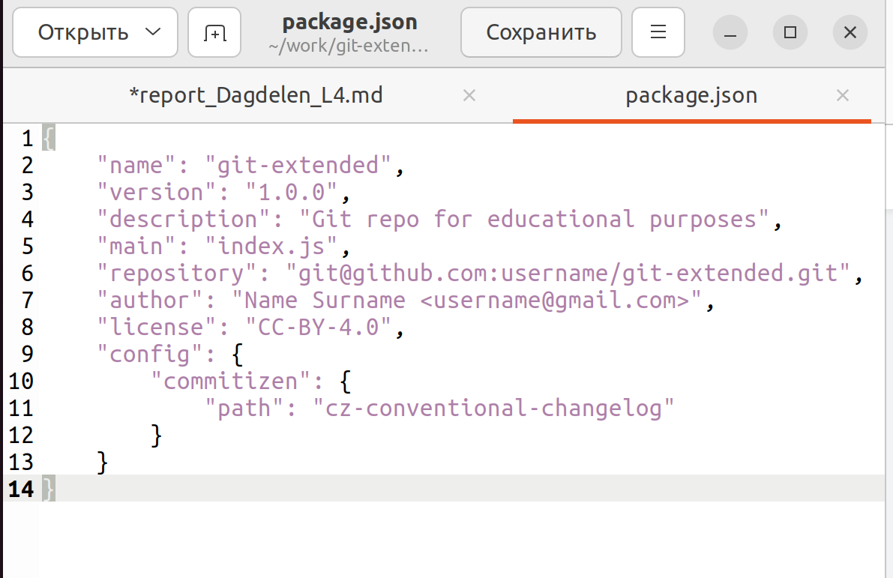{#fig:014 width=70%}
			
			
			- Добавляю новые файлы (git add .), выполняю коммит (git cz) и отправляю на github (git push) (рис. [-@fig:015] - рис. [-@fig:016]).
			
			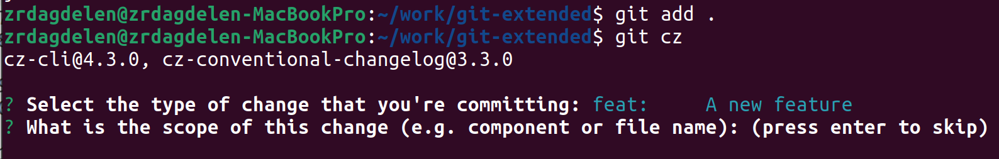{#fig:015 width=70%}
			
			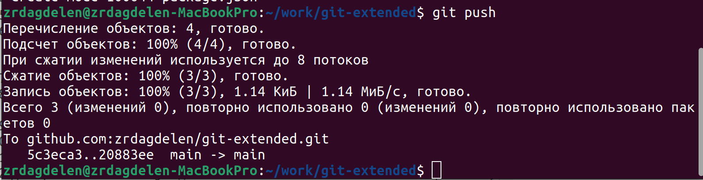{#fig:016 width=70%}
			
		3. Конфигурация git-flow. 
			- Инициализирую git-flow (с помощью git flow init)(рис. [-@fig:017]). Префикс для ярлыков установлю в v.
			
			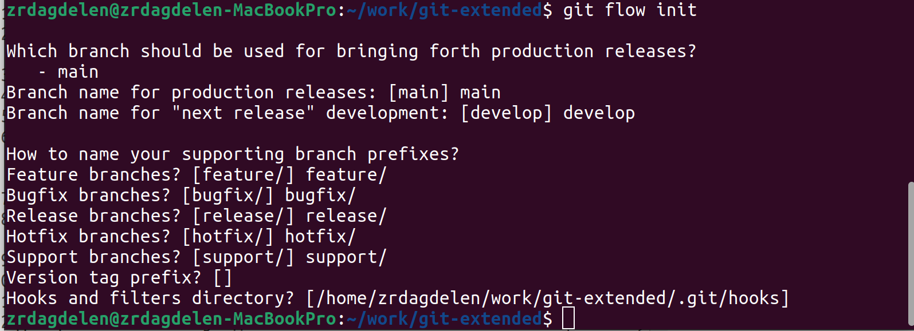{#fig:017 width=70%}

    			- Проверяю, что нахожусь на ветке develop (git branch) (рис. [-@fig:018]).
			
			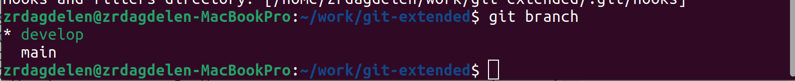{#fig:018 width=70%}

    			- Загружаю весь репозиторий в хранилище (git push --all) (рис. [-@fig:019]).
			
			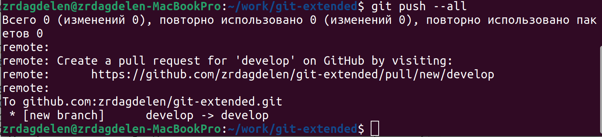{#fig:019 width=70%}

    			- Устанавливаю внешнюю ветку как вышестоящую для этой ветки (git branch --set-upstream-to=origin/develop develop) и создаю релиз с версией 1.0.0 (git flow release start 1.0.0) (рис. [-@fig:020]).
			
			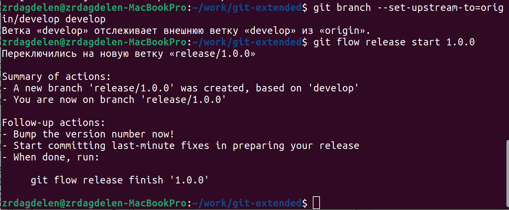{#fig:020 width=70%}

    			- Создаю журнал изменений (standard-changelog --first-release) (рис. [-@fig:021]).
			
			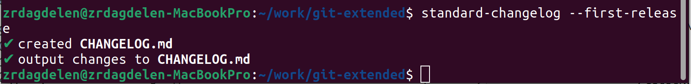{#fig:021 width=70%}

    			- Добавляю журнал изменений в индекс (git add CHANGELOG.md; git commit -am 'chore(site): add changelog') и заливаю релизную ветку в основную ветку (git flow release finish 1.0.0) (рис. [-@fig:022]).
			
			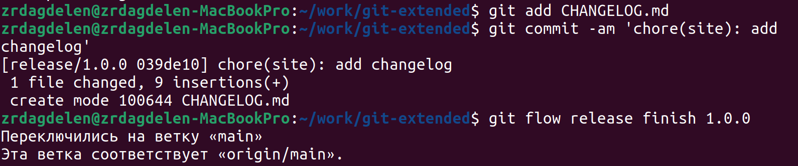{#fig:022 width=70%}

    			- Отправляю данные на github (git push --all; git push --tags) (рис. [-@fig:023]).
			
			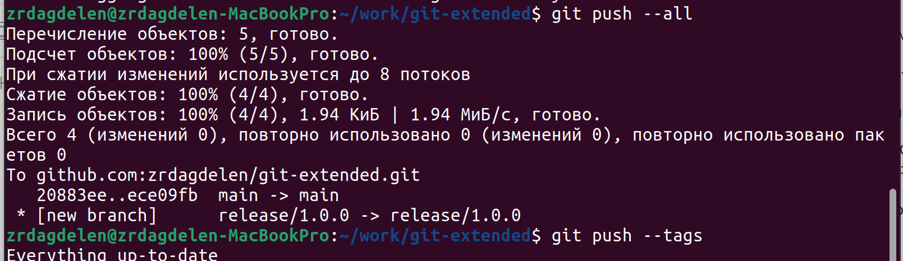{#fig:023 width=70%}

    			- Создаю релиз на github. Для этого буду использовать утилиты работы с github (gh release create v1.0.0 -F CHANGELOG.md) (рис. [-@fig:024]).
			
			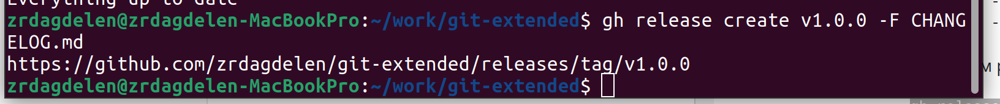{#fig:024 width=70%}

		2. Работа с репозиторием git
			1. Разработка новой функциональности
				- Создаю ветку для новой функциональности (git flow feature start feature_branch) (рис. [-@fig:025]).
				
				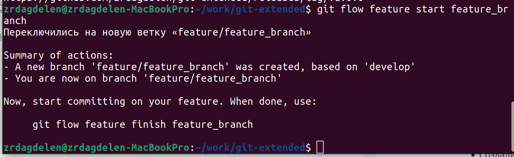{#fig:025 width=70%}

    				- Далее, продолжаю работу c git как обычно.

    				- По окончании разработки новой функциональности следующим шагом объединяю ветку feature branch c develop  (git flow feature finish feature_branch) (рис. [-@fig:026]).
    				
    				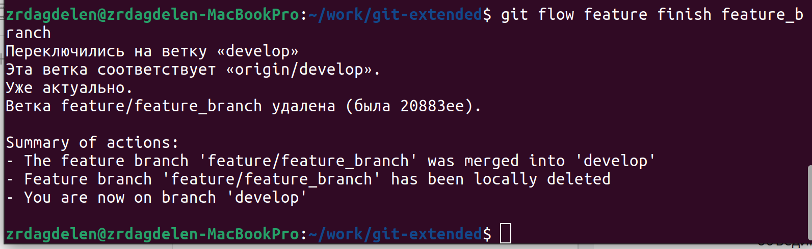{#fig:026 width=70%}
			
			2. Создание релиза git-flow
				- Создаю релиз с версией 1.2.3 (git flow release start 1.2.3) (рис. [-@fig:027]).
    				
    				{#fig:027 width=70%}

    				- Обновляю номер версии в файле package.json. Устанавливаю её в 1.2.3. (рис. [-@fig:028]).
    				
    				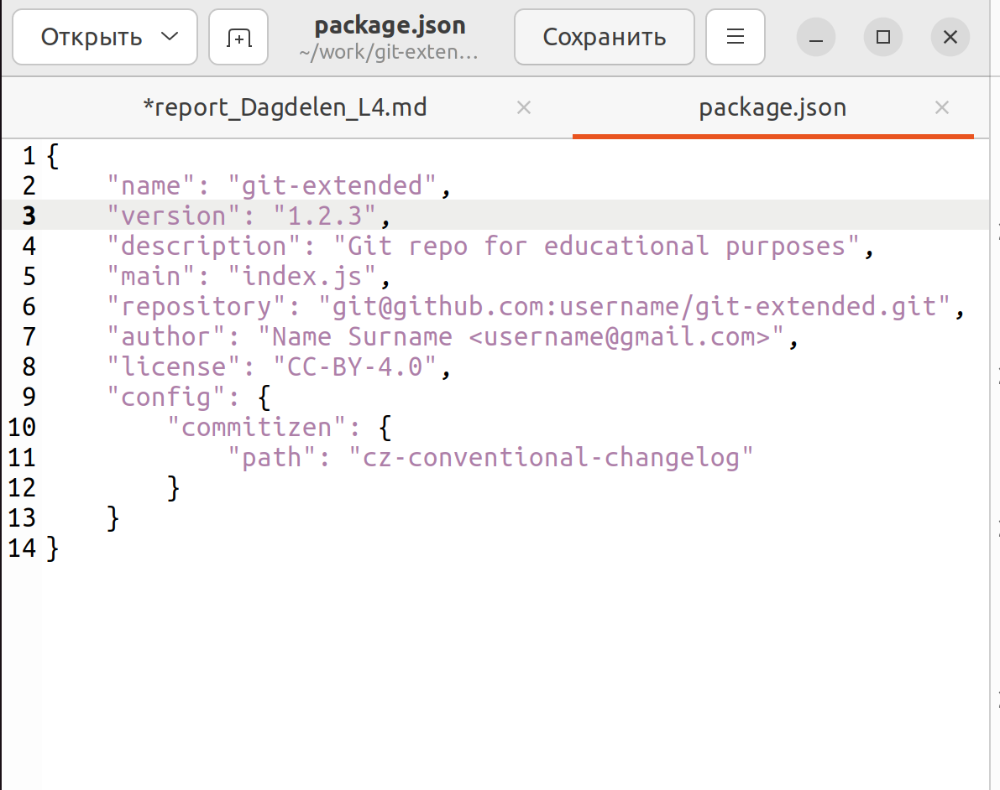{#fig:028 width=70%}

    				- Создаю журнал изменений (standard-changelog) (рис. [-@fig:029]).
    				
    				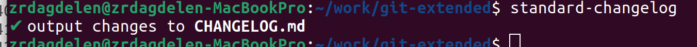{#fig:029 width=70%}

    				- Добавляю журнал изменений в индекс (git add CHANGELOG.md; git commit -am 'chore(site): update changelog')(рис. [-@fig:030]).
    				
    				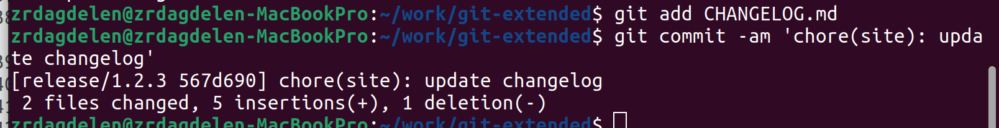{#fig:030 width=70%}

    				- Залью релизную ветку в основную ветку (git flow release finish 1.2.3)(рис. [-@fig:031]).
    				
    				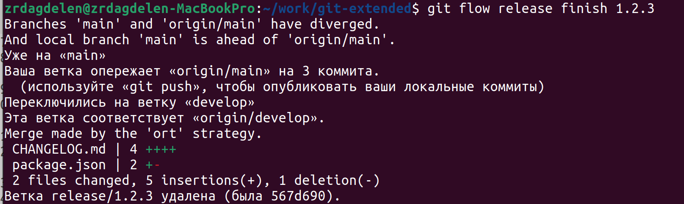{#fig:031 width=70%}

    				- Отправляю данные на github (git push --all; git push --tags)(рис. [-@fig:032]).
    				
    				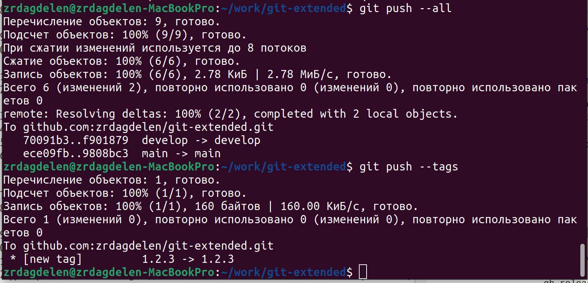{#fig:032 width=70%}

    				- Создадим релиз на github с комментарием из журнала изменений (gh release create v1.2.3 -F CHANGELOG.md)(рис. [-@fig:033]).
    				
    				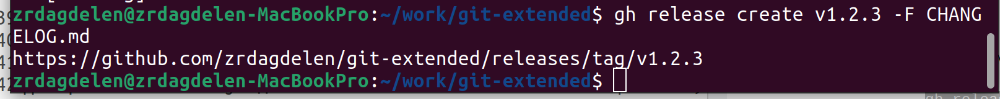{#fig:033 width=70%}

# Выводы

Я получила навыки правильной работы с репозиториями git.

# Список литературы{.unnumbered}

(Операционные системы)[https://esystem.rudn.ru/mod/page/view.php?id=1098794]
