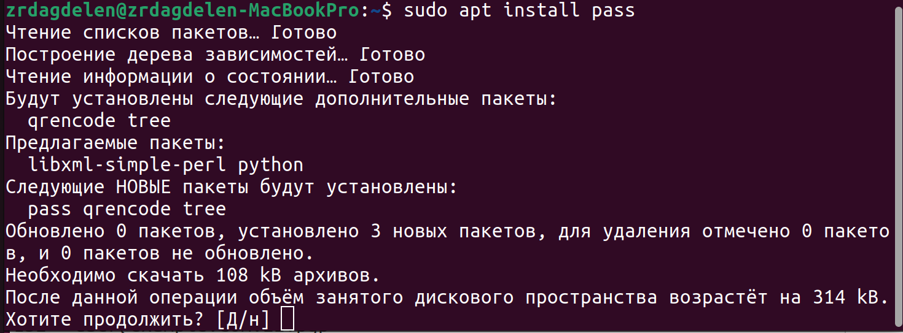
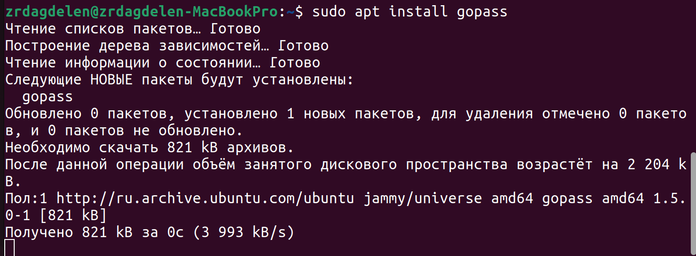
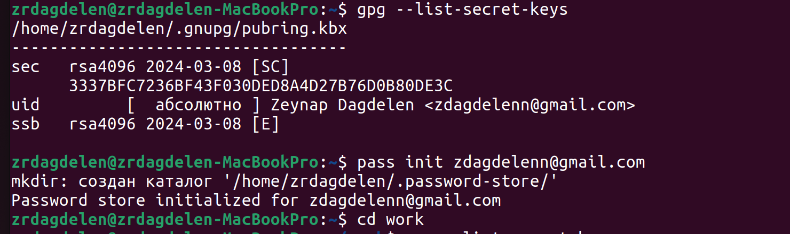
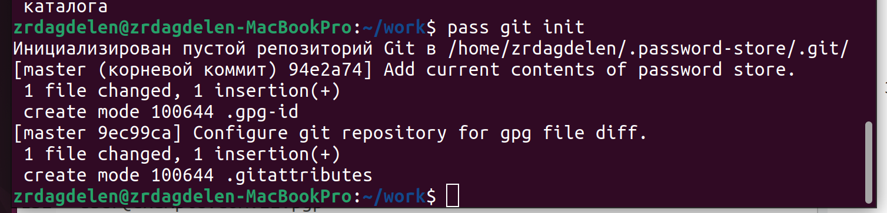
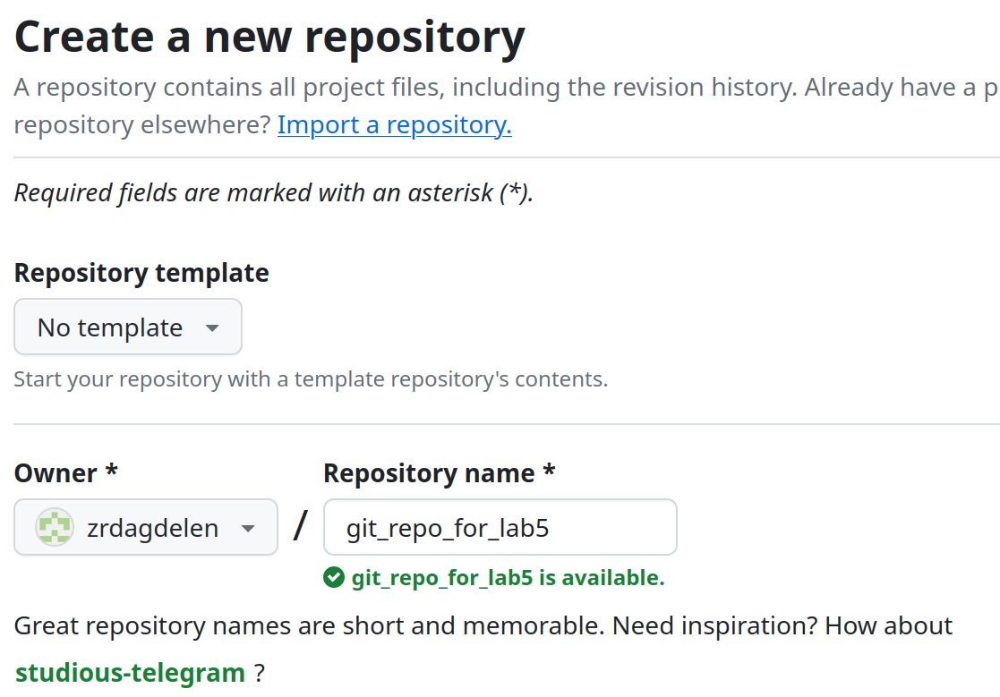
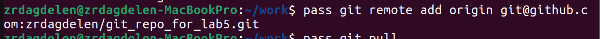

---
## Front matter
title: "Отчет по лабораторной работе №5"
subtitle: "Настройка рабочей среды."
author: "Дагделен Зейнап Реджеповна"

## Generic otions
lang: ru-RU
toc-title: "Содержание"

## Bibliography
bibliography: bib/cite.bib
csl: pandoc/csl/gost-r-7-0-5-2008-numeric.csl

## Pdf output format
toc: true # Table of contents
toc-depth: 2
lof: true # List of figures
lot: true # List of tables
fontsize: 12pt
linestretch: 1.5
papersize: a4
documentclass: scrreprt
## I18n polyglossia
polyglossia-lang:
  name: russian
  options:
	- spelling=modern
	- babelshorthands=true
polyglossia-otherlangs:
  name: english
## I18n babel
babel-lang: russian
babel-otherlangs: english
## Fonts
mainfont: PT Serif
romanfont: PT Serif
sansfont: PT Sans
monofont: PT Mono
mainfontoptions: Ligatures=TeX
romanfontoptions: Ligatures=TeX
sansfontoptions: Ligatures=TeX,Scale=MatchLowercase
monofontoptions: Scale=MatchLowercase,Scale=0.9
## Biblatex
biblatex: true
biblio-style: "gost-numeric"
biblatexoptions:
  - parentracker=true
  - backend=biber
  - hyperref=auto
  - language=auto
  - autolang=other*
  - citestyle=gost-numeric
## Pandoc-crossref LaTeX customization
figureTitle: "Рис."
tableTitle: "Таблица"
listingTitle: "Листинг"
lofTitle: "Список иллюстраций"
lotTitle: "Список таблиц"
lolTitle: "Листинги"
## Misc options
indent: true
header-includes:
  - \usepackage{indentfirst}
  - \usepackage{float} # keep figures where there are in the text
  - \floatplacement{figure}{H} # keep figures where there are in the text
---

# Цель работы

Научиться настраивать рабочую среду 

# Задание

1) Менеджер паролей pass
	-Установка
        -Настройка
        -Настройка интерфейса с броузером
        -Сохранение пароля
2) Управление файлами конфигурации
3) Дополнительное программное обеспечение
        -Установка
        -Создание собственного репозитория с помощью утилит
        -Подключение репозитория к своей системе
        -Использование chezmoi на нескольких машинах
        -Настройка новой машины с помощью одной команды
        -Ежедневные операции c chezmoi

# Теоретическое введение

## Менеджер паролей pass

- Менеджер паролей pass — программа, сделанная в рамках идеологии Unix.
- Также носит название стандартного менеджера паролей для Unix (The standard Unix password manager).

## Основные свойства

- Данные хранятся в файловой системе в виде каталогов и файлов.
- Файлы шифруются с помощью GPG-ключа.

## Структура базы паролей

- Структура базы может быть произвольной, если Вы собираетесь использовать её напрямую, без промежуточного программного обеспечения. Тогда семантику структуры базы данных Вы держите в своей голове.
- Если же необходимо использовать дополнительное программное обеспечение, необходимо семантику заложить в структуру базы паролей.

## Семантическая структура базы паролей

Рассмотрим пользователя user в домене example.com, порт 22. Отсутствие имени пользователя или порта в имени файла означает, что любое имя пользователя и порт будут совпадать:

> example.com.pgp

Соответствующее имя пользователя может быть именем файла внутри каталога, имя которого совпадает с хостом. Это полезно, если в базе есть пароли для нескольких пользователей на одном хосте:

> example.com/user.pgp

Имя пользователя также может быть записано в виде префикса, отделенного от хоста знаком @:

> user@example.com.pgp

Соответствующий порт может быть указан после хоста, отделённый двоеточием (:):

> example.com:22.pgp
  example.com:22/user.pgp
  user@example.com:22.pgp

Эти все записи могут быть расположены в произвольных каталогах, задающих Вашу собственную иерархию.

# Выполнение лабораторной работы

## Установка

Установлю pass и gopass на Ubuntu (рис. [-@fig:001] - рис. [-@fig:002]).

{#fig:001 width=70%}

{#fig:002 width=70%}

## Настройка

Просмотрю список ключей GPG (gpg --list-secret-keys) и инициализируем хранилище (рис. [-@fig:003]), перейду в каталог work с помощью сd.

{#fig:003 width=70%}

Синхронизация с git. Создам структуру git (pass git init)(рис. [-@fig:004])

{#fig:004 width=70%}

Также можно задать адрес репозитория на хостинге (репозиторий необходимо предварительно создам)(рис. [-@fig:005] - рис. [-@fig:006]).

{#fig:005 width=70%}

{#fig:006 width=70%}

Для синхронизации выполняю следующую команду

    pass git pull
    pass git push

Прямые изменения

Следует заметить, что отслеживаются только изменения, сделанные через сам gopass (или pass).

Если изменения сделаны непосредственно на файловой системе, необходимо вручную закоммитить и выложить изменения:

        cd ~/.password-store/
        git add .
        git commit -am 'edit manually'
        git push

Проверить статус синхронизации командой

        pass git status

Настройка интерфейса с броузером

    Для взаимодействия с броузером используется интерфейс native messaging.
    Поэтому кроме плагина к броузеру устанавливается программа, обеспечивающая интерфейс native messaging.

    Плагин browserpass
        Репозиторий: https://github.com/browserpass/browserpass-extension
        Плагин для брoузера
            Плагин для Firefox: https://addons.mozilla.org/en-US/firefox/addon/browserpass-ce/.
            Плагин для Chrome/Chromium: https://chrome.google.com/webstore/detail/browserpass-ce/naepdomgkenhinolocfifgehidddafch.

        Интерфейс для взаимодействия с броузером (native messaging)
            Репозиторий: https://github.com/browserpass/browserpass-native

            Gentoo:

            emerge www-plugins/browserpass

            Fedora

            dnf copr enable maximbaz/browserpass
            dnf install browserpass

Сохранение пароля

    Добавить новый пароль

        Выполните:

        pass insert [OPTIONAL DIR]/[FILENAME]

            OPTIONAL DIR: необязательное имя каталога, определяющее файловую структуру для вашего хранилища паролей;
            FILENAME: имя файла, который будет использоваться для хранения пароля.

        Отобразите пароль для указанного имени файла:

        pass [OPTIONAL DIR]/[FILENAME]

        Замените существующий пароль:

        pass generate --in-place FILENAME

Управление файлами конфигурации

Дополнительное программное обеспечение

    Установите дополнительное программное обеспечение:

    sudo dnf -y install \
         dunst \
         fontawesome-fonts \
         powerline-fonts \
         light \
         fuzzel \
         swaylock \
         kitty \
         waybar swaybg \
         wl-clipboard \
         mpv \
         grim \
         slurp

    Установите шрифты:

    sudo dnf copr enable peterwu/iosevka
    sudo dnf search iosevka
    sudo dnf install iosevka-fonts iosevka-aile-fonts iosevka-curly-fonts iosevka-slab-fonts iosevka-etoile-fonts iosevka-term-fonts

Установка

    Установка бинарного файла. Скрипт определяет архитектуру процессора и операционную систему и скачивает необходимый файл:

        с помощью wget:

        sh -c "$(wget -qO- chezmoi.io/get)"

Создание собственного репозитория с помощью утилит

    Будем использовать утилиты командной строки для работы с github.

    Создадим свой репозиторий для конфигурационных файлов на основе шаблона:

    gh repo create dotfiles --template="yamadharma/dotfiles-template" --private

Подключение репозитория к своей системе

    Инициализируйте chezmoi с вашим репозиторием dotfiles:

    chezmoi init git@github.com:<username>/dotfiles.git

    Проверьте, какие изменения внесёт chezmoi в домашний каталог, запустив:

    chezmoi diff

    Если вас устраивают изменения, внесённые chezmoi, запустите:

    chezmoi apply -v

Использование chezmoi на нескольких машинах

    На второй машине инициализируйте chezmoi с вашим репозиторием dotfiles:

    chezmoi init https://github.com/<username>/dotfiles.git

    Или через ssh:

    chezmoi init git@github.com:<username>/dotfiles.git

    Проверьте, какие изменения внесёт chezmoi в домашний каталог, запустив:

    chezmoi diff

    Если вас устраивают изменения, внесённые chezmoi, запустите:

    chezmoi apply -v

    Если вас не устраивают изменения в файле, отредактируйте его с помощью:

    chezmoi edit file_name

    Также можно вызвать инструмент слияния, чтобы объединить изменения между текущим содержимым файла, файлом в вашей рабочей копии и измененным содержимым файла:

    chezmoi merge file_name

    При существующем каталоге chezmoi можно получить и применить последние изменения из вашего репозитория:

    chezmoi update -v

Настройка новой машины с помощью одной команды

    Можно установить свои dotfiles на новый компьютер с помощью одной команды:

    chezmoi init --apply https://github.com/<username>/dotfiles.git

    Через ssh:

    chezmoi init --apply git@github.com:<username>/dotfiles.git

Ежедневные операции c chezmoi

    Извлеките последние изменения из репозитория и примените их

        Можно извлечь изменения из репозитория и применить их одной командой:

        chezmoi update

        Это запускается git pull --autostash --rebase в вашем исходном каталоге, а затем chezmoi apply.

    Извлеките последние изменения из своего репозитория и посмотрите, что изменится, фактически не применяя изменения

        Выполните:

        chezmoi git pull -- --autostash --rebase && chezmoi diff

        Это запускается git pull --autostash --rebase в вашем исходном каталоге, а chezmoi diff затем показывает разницу между целевым состоянием, вычисленным из вашего исходного каталога, и фактическим состоянием.

        Если вы довольны изменениями, вы можете применить их:

        chezmoi apply

    Автоматически фиксируйте и отправляйте изменения в репозиторий
        Можно автоматически фиксировать и отправлять изменения в исходный каталог в репозиторий.
        Эта функция отключена по умолчанию.

        Чтобы включить её, добавьте в файл конфигурации ~/.config/chezmoi/chezmoi.toml следующее:

        [git]
            autoCommit = true
            autoPush = true

        Всякий раз, когда в исходный каталог вносятся изменения, chezmoi фиксирует изменения с помощью автоматически сгенерированного сообщения фиксации и отправляет их в ваш репозиторий.
        Будьте осторожны при использовании autoPush. Если ваш репозиторий dotfiles является общедоступным, и вы случайно добавили секрет в виде обычного текста, этот секрет будет отправлен в ваш общедоступный репозиторий.

# Выводы

Я настроила рабочую среду

# Список литературы{.unnumbered}

[Операционные системы](https://esystem.rudn.ru/mod/page/view.php?id=1098796)
