---
## Front matter
lang: ru-RU
title: Лабораторная работа № 7
subtitle: Анализ файловой системы Linux. Команды для работы с файлами и каталогами
author:
  - Дагделен З. Р.
institute:
  - Российский университет дружбы народов, Москва, Россия
date: 21 марта 2024

## i18n babel
babel-lang: russian
babel-otherlangs: english

## Formatting pdf
toc: false
toc-title: Содержание
slide_level: 2
aspectratio: 169
section-titles: true
theme: metropolis
header-includes:
 - \metroset{progressbar=frametitle,sectionpage=progressbar,numbering=fraction}
 - '\makeatletter'
 - '\beamer@ignorenonframefalse'
 - '\makeatother'
---

## Докладчик

:::::::::::::: {.columns align=center}
::: {.column width="70%"}

  * Дагделен Зейнап Реджеповна
  * студентка из группы НКАбд-02-23
  * Факультет физико-математических и естественных наук
  * Российский университет дружбы народов
  * [1132236052@rudn.ru](mailto:1132236052@rudn.ru)
  * <https:///zrdagdelen.github.io>

:::
::: {.column width="30%"}
:::
::::::::::::::

## Цель работы

Целью данной лабораторной работы является ознакомление с файловой системой Linux, её структурой, именами и содержанием каталогов. Приобретение практических навыков по применению команд для работы
с файлами и каталогами, по управлению процессами (и работами), по проверке использования диска и обслуживанию файловой системы

## Задание

1. Выполнить все примеры из лабораторной работы
2. Выполнить команды по копированию, созданию и перемещению файлов и каталогов
3. Определить опции команды chmod
4. Изменить права доступа к файлам
5. Прочитать документацию о командах mount, fsck, mkfs, kill

# Выполнение лабораторной работы

## Выполнение примеров

Создаю файл, дважды копирую его с новыми именами и проверяю, что все команды были выполнены корректно.

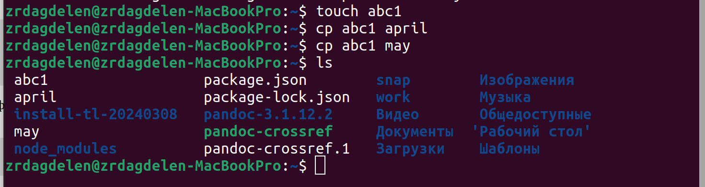{#fig:001 width=50%}

## Выполнение примеров

Создаю директорию, копирую в нее два файла, созданных на прошлом этапе, проверяю, что все скопировалось.

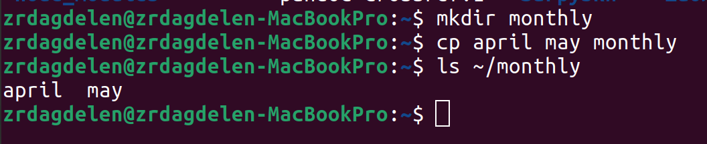{#fig:002 width=50%}

## Выполнение примеров

Копирую файл, находящийся не в текущей диреткории в файл с новым именем тоже не  текущей директории.

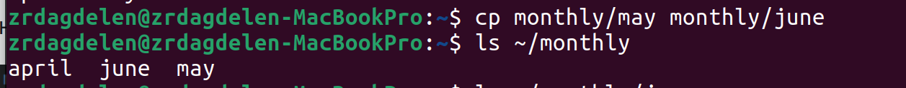{#fig:003 width=50%}

## Выполнение примеров

Создаю новую директорию. Копирую предыдущую созданную директорию вместе со всем содержимым в каталог /tmp и копирую предыдущую созданную директорию в новую созданную.

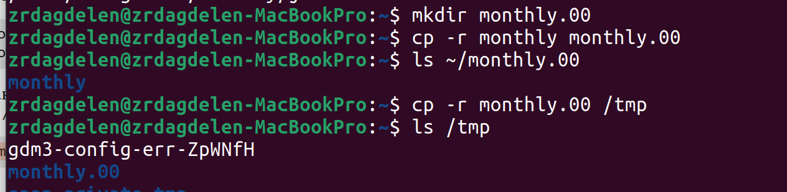{#fig:004 width=50%}

## Выполнение примеров

Переименовываю файл, затем перемещаю его в каталог.

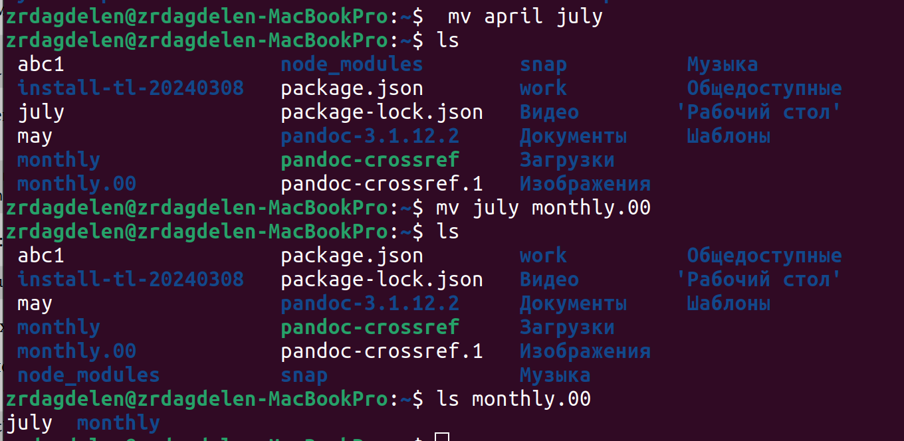{#fig:005 width=40%}

## Выполнение примеров

Создаю новую диреткорию, переименовываю monthly.00 в monthly.01, перемещаю директорию в директорию reports, переименовываю эту директорию, убираю из названия 01.

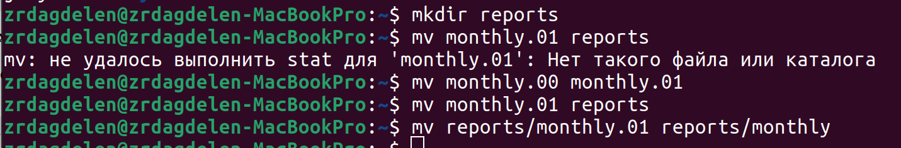{#fig:006 width=50%}

## Выполнение примеров

Создаю пустой файл, проверяю права доступа у него, изменяю права доступа, добавляя пользователю (создателю) возможность выполнять файл .

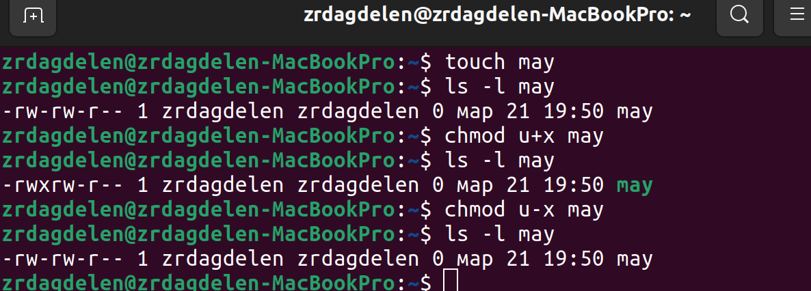{#fig:007 width=30%}

## Выполнение примеров

Меняю права доступа у директории: группы и остальные пользователи не смогут ее прочесть.

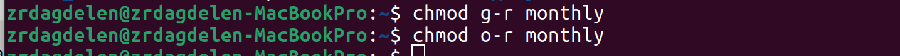{#fig:008 width=50%}

## Выполнение примеров

Изменяю права доступа у директории, запрещаю группам и остальным пользователям читать. Создаю новый пустой файл, даю ему права доступа.

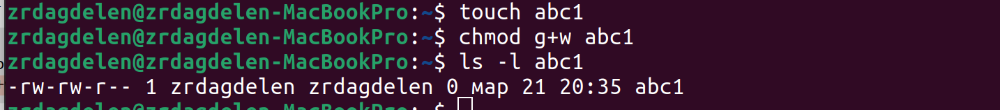{#fig:009 width=50%}

## Выполнение примеров

Проверяю файловую систему.

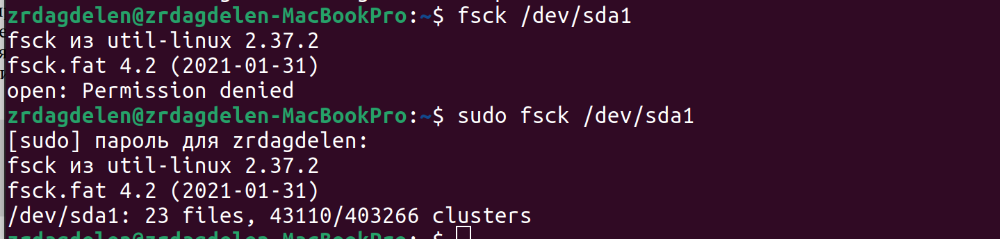{#fig:010 width=50%}

## Выполнить команды по копированию, созданию и перемещению файлов и каталогов

Копирую файл в домашний каталог с новым именем, создаю новую пустую директорию, перемещаю файл в эту директорию, переименовываю файл.

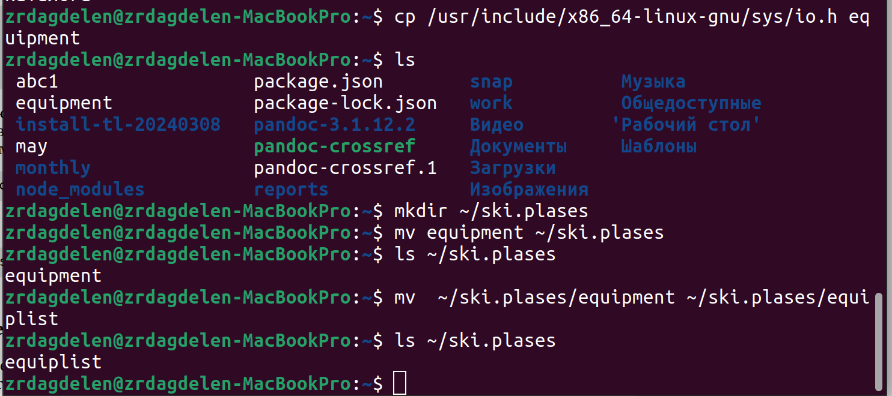{#fig:011 width=50%}

## Выполнить команды по копированию, созданию и перемещению файлов и каталогов

Создаю новый файл, копирую его в новую директорию, но уже сразу с новым именем. Создаю внутри этого каталога подкаталог, перемещаю файлы в подкаталог.

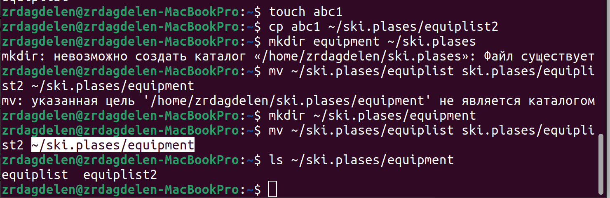{#fig:012 width=50%}

## Выполнить команды по копированию, созданию и перемещению файлов и каталогов

Создаю новую директорию, в этой же строчке перемещаю ее с новым именем в директорию, созданную в прошлый раз.

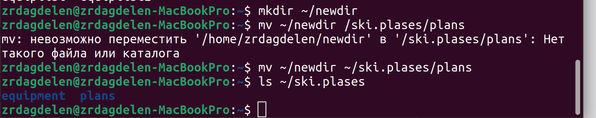{#fig:013 width=50%}

## Определить опции команды chmod

Проверяю, какие права нужно поменять и как, чтобу у новой директория были нужные по заданию права.

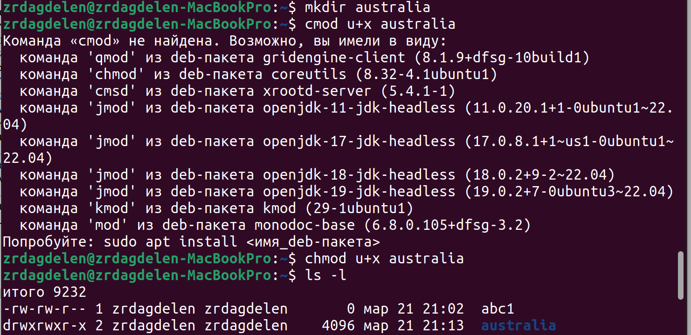{#fig:014 width=40%}

## Определить опции команды chmod

Проверяю, какие права нужно поменять и как, чтобу у новых файлов были нужные по заданию права.

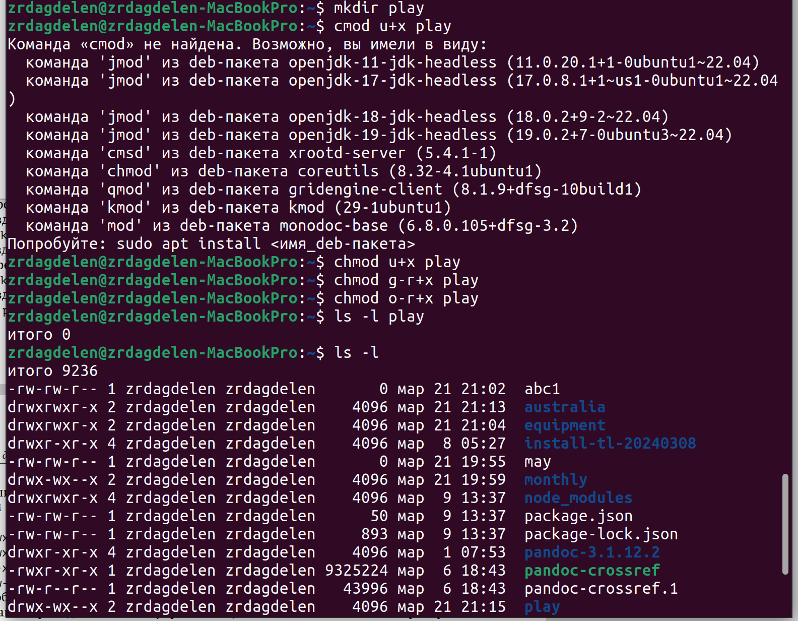{#fig:015 width=40%}

## Определить опции команды chmod

Создаю файл, добавляю в правах доступа право но исполнение и убираю право на запись для владельца, затем создаю следующий файл, ему в правах доступа добавляю право на запись для группы.

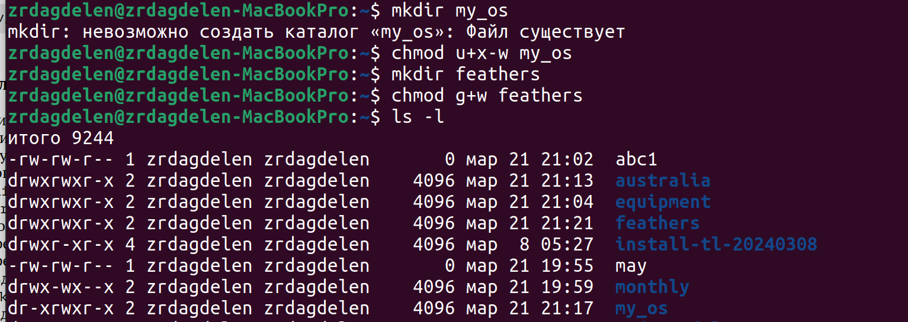{#fig:016 width=50%}

## Чтение файла

Читаю содержимое файла.

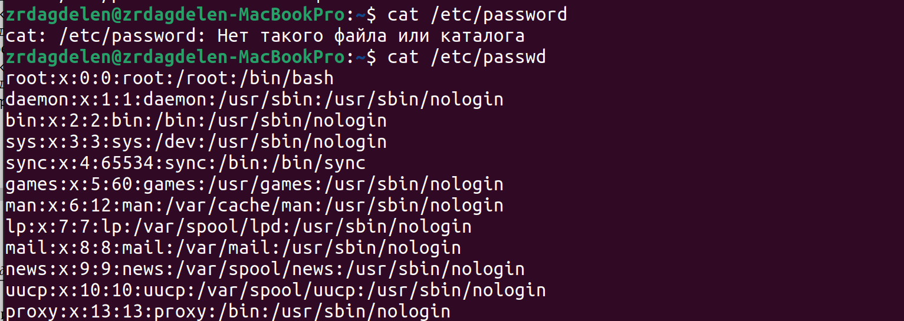{#fig:017 width=50%}

## Выполнить команды по копированию, созданию и перемещению файлов и каталогов

Копирую файл с новым именем, перемещаю его в ранее созданную директорию, рекурсивно ее копирую с новым именем, рекурсивно копирую в нее скопированную до этого папку.

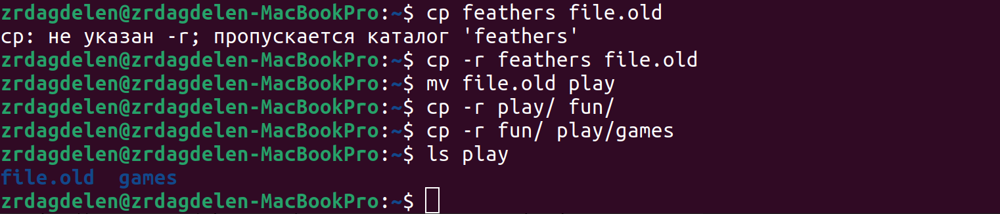{#fig:018 width=50%}

## Изменить права доступа к файлам

Убираю право на чтение у файла для создателя, поэтому не могу его прочесть, также не могу его скопировать, потому что отказано в доступе на чтение, возвращаю все права.

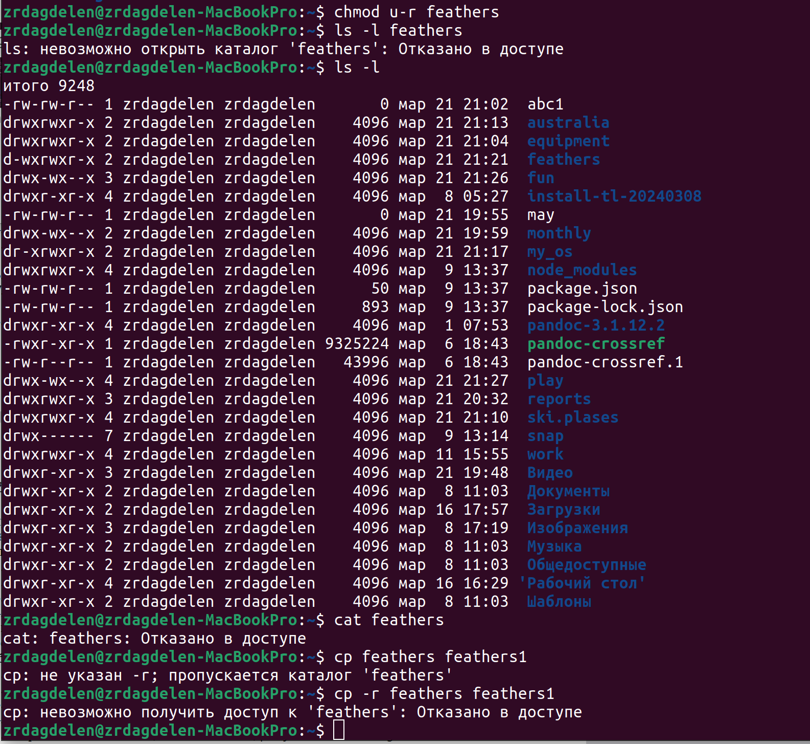{#fig:019 width=30%}

## Изменить права доступа к файлам

Убираю у директории право на исполнение для пользователя, пытаюсь в нее войти - отказано в доступе, возвращаю все права.

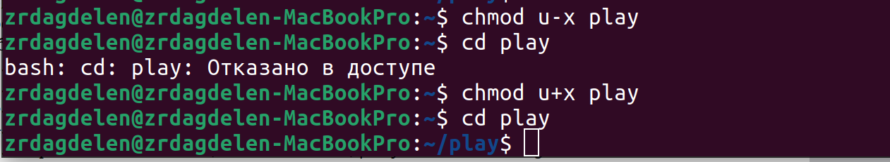{#fig:020 width=50%}

## Прочитать документацию о командах mount, fsck, mkfs, kill

- mount — утилита командной строки в UNIX-подобных операционных системах. Применяется для монтирования файловых систем.
- fsck (проверка файловой системы) - это утилита командной строки, которая позволяет выполнять проверки согласованности и интерактивное исправление в одной или нескольких файловых системах Linux. Он использует программы, специфичные для типа файловой системы, которую он проверяет.

## Прочитать документацию о командах mount, fsck, mkfs, kill

- mkfs используется для создания файловой системы Linux на некотором устройстве, обычно в разделе жёсткого диска. В качестве аргумента filesys для файловой системы может выступать или название устройства
- Команда Kill посылает указанный сигнал указанному процессу. Если не указано ни одного сигнала, посылается сигнал SIGTERM. Сигнал SIGTERM завершает лишь те процессы, которые не обрабатывают его приход. Для других процессов может быть необходимым послать сигнал SIGKILL, поскольку этот сигнал перехватить невозможно.

## Выводы

При выполнении данной лабораторной работы я ознакомилась с файловой системой Linux, её структурой, именами и содержанием каталогов. Приобрела практические навыки по применению команд для работы
с файлами и каталогами, по управлению процессами (и работами), по проверке использования диска и обслуживанию файловой системы

# Спасибо за внимание 
