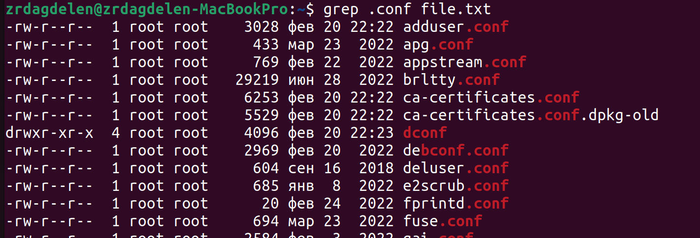
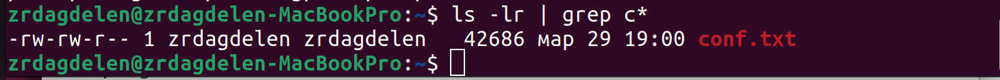
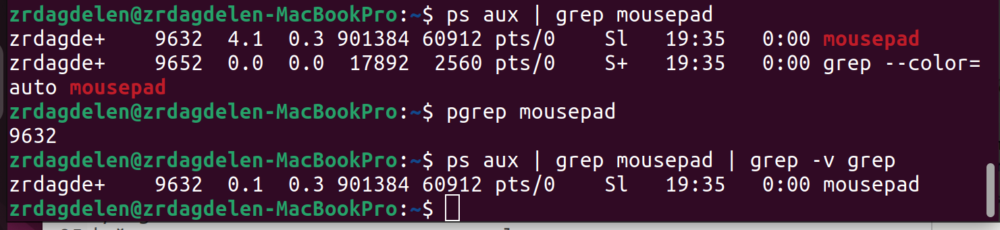
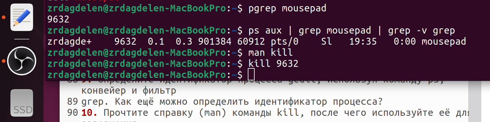
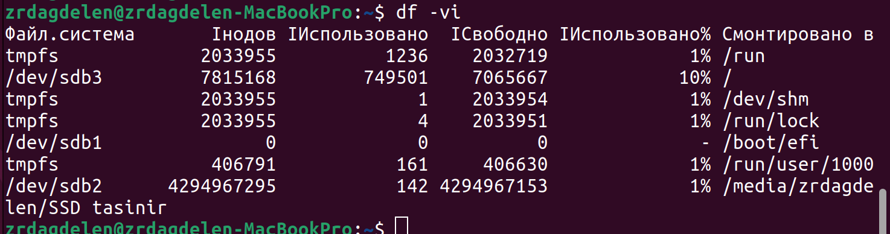
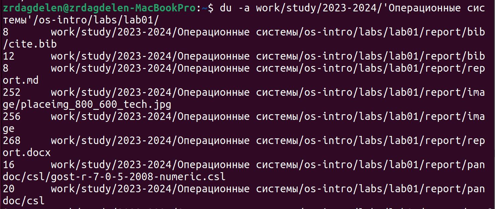
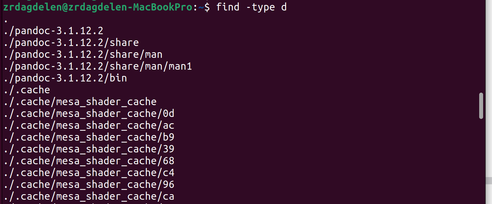

---
## Front matter
lang: ru-RU
title: Лабораторная работа №8
subtitle: Поиск файлов. Перенаправление ввода-вывода. Просмотр запущенных процессов
author:
  - Дагделен З. Р.
institute:
  - Российский университет дружбы народов, Москва, Россия
date: 29 марта 2024

## i18n babel
babel-lang: russian
babel-otherlangs: english

## Formatting pdf
toc: false
toc-title: Содержание
slide_level: 2
aspectratio: 169
section-titles: true
theme: metropolis
header-includes:
 - \metroset{progressbar=frametitle,sectionpage=progressbar,numbering=fraction}
 - '\makeatletter'
 - '\beamer@ignorenonframefalse'
 - '\makeatother'
---

# Информация

## Докладчик

:::::::::::::: {.columns align=center}
::: {.column width="70%"}

  * Дагделен Зейнап Реджеповна
* студентка из группы НКАбд-02-23
  * Факультет физико-математических и естественных наук
  * Российский университет дружбы народов
  * [1132236052@rudn.ru](mailto:1132226447@rudn.ru)
  * <https:///zrdagdelen.github.io>

:::
::: {.column width="30%"}

:::
::::::::::::::

## Цель работы

Цель данной лабораторной работы - ознакомление с инструментами поиска файлов и фильтрации текстовых данных, а также приобретение практических навыков по управлению процессами (и заданиями), по проверке использования диска и по обслуживанию файловых систем.

# Выполнение лабораторной работы

## Выполнение лабораторной работы

Записала в файл file.txt названия файлов из каталога /etc с помощью перенаправления ">".

## Выполнение лабораторной работы

Добавила в созданный файл имена файлов из домашнего каталога, используя перенаправление ">>" в режиме добавления.

## Выполнение лабораторной работы

Вывела на экран имена всех файлов, имеющих расширение ".conf" с помощью утилиты grep

## Выполнение лабораторной работы

Добавила вывод прошлой команды в новый файл conf.txt с помощью перенаправления ">".

## Выполнение лабораторной работы

Определяю, какие файлы в домашнем каталоге начинаютя с символа "c" с помощью утилиты find, прописываю ей в аргументах домашнюю директорию, выбираю опцию -name.

## Выполнение лабораторной работы

Второй способ использовать утилиту ls -lR и использовать grep, чтобы найти элементы с первым символом c.

## Выполнение лабораторной работы

Запускаю в фоновом режиме (на это указывает символ &) процесс, который будет записывать в файл logfile файлы, имена которых начинаются с log.

## Выполнение лабораторной работы

Запускаю в консоли в фоновом режиме редактор mousepad.

## Выполнение лабораторной работы

С помощью утилиты ps определяю идентификатор процесса mousepad. Также мы можем определить идентификатор с помощью pgrep.

## Выполнение лабораторной работы

Использую команду kill и идентификатор процесса, чтобы его удалить.

## Выполнение лабораторной работы

Использую утилиту df. Эта утилита нам нужна, чтобы выяснить, сколько свободного места есть у системы.

## Выполнение лабораторной работы

Использую утилиту du. Она нужна чтобы просмотреть, сколько места занимают файлы в определенной директории.

## Выполнение лабораторной работы

Вывела имена всех директорий, имеющихся в моем домашнем каталоге.

## Выводы

В результате данной лабораторной работы я ознакомилась с инструментами поиска файлов и фильтрации текстовых данных, а также приобрела практические навыки по управлению процессами (и заданиями), по проверке использования диска и по обслуживанию файловых систем.
