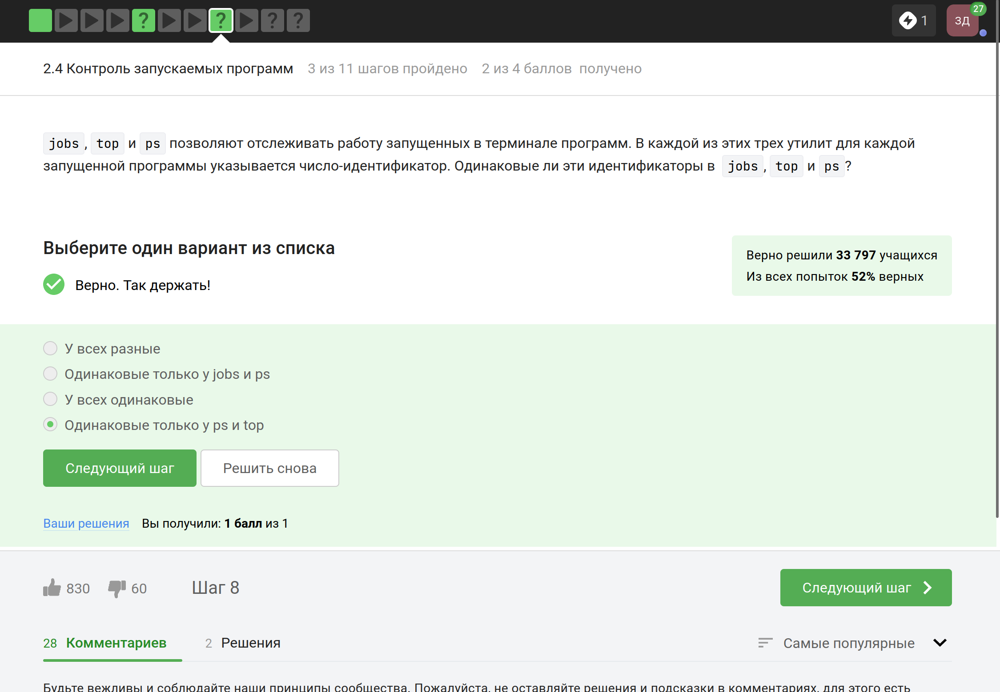
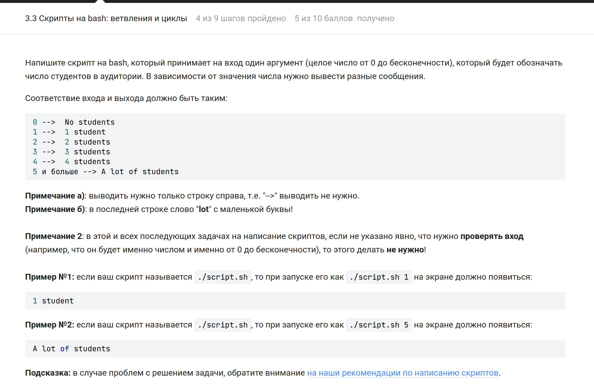
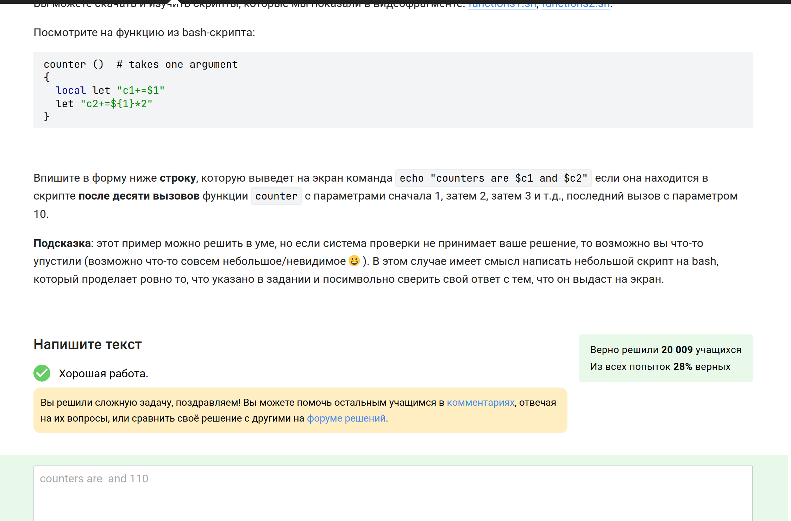

---
## Front matter
title: "Отчёт по прохождению внешнего курса"
subtitle: "1-3 части"
author: "Дагделен Зейнап Реджеповна"

## Generic otions
lang: ru-RU
toc-title: "Содержание"

## Bibliography
bibliography: bib/cite.bib
csl: pandoc/csl/gost-r-7-0-5-2008-numeric.csl

## Pdf output format
toc: true # Table of contents
toc-depth: 2
lof: true # List of figures
lot: true # List of tables
fontsize: 12pt
linestretch: 1.5
papersize: a4
documentclass: scrreprt
## I18n polyglossia
polyglossia-lang:
  name: russian
  options:
	- spelling=modern
	- babelshorthands=true
polyglossia-otherlangs:
  name: english
## I18n babel
babel-lang: russian
babel-otherlangs: english
## Fonts
mainfont: PT Serif
romanfont: PT Serif
sansfont: PT Sans
monofont: PT Mono
mainfontoptions: Ligatures=TeX
romanfontoptions: Ligatures=TeX
sansfontoptions: Ligatures=TeX,Scale=MatchLowercase
monofontoptions: Scale=MatchLowercase,Scale=0.9
## Biblatex
biblatex: true
biblio-style: "gost-numeric"
biblatexoptions:
  - parentracker=true
  - backend=biber
  - hyperref=auto
  - language=auto
  - autolang=other*
  - citestyle=gost-numeric
## Pandoc-crossref LaTeX customization
figureTitle: "Рис."
tableTitle: "Таблица"
listingTitle: "Листинг"
lofTitle: "Список иллюстраций"
lotTitle: "Список таблиц"
lolTitle: "Листинги"
## Misc options
indent: true
header-includes:
  - \usepackage{indentfirst}
  - \usepackage{float} # keep figures where there are in the text
  - \floatplacement{figure}{H} # keep figures where there are in the text
---

# Цель работы

Цель -- пройти курс на степике ([ссылка](https://stepik.org/course/73))

# Задание

1. Введение
2. Работа на сервере
3. Продвинутые темы
4. Сертификат

# Выполнение заданий

## 1. Введение

Объяснение: курс называется "Введение в Linux"(рис. [-@fig:001]).

{#fig:001 width=70%}

Объяснение: стандартные правила stepik, ничего новго (рис. [-@fig:002]).

{#fig:002 width=70%}

Объяснение: обучаясь в университете, я пользуюсь Linux и Windows(рис. [-@fig:003]).

{#fig:003 width=70%}

Объяснение: виртуальная машина -- это НЕ ОС, а специальная программа, ее можно запустить в Windows т начать пользоваться Linux (например)(рис. [-@fig:004]).

{#fig:004 width=70%}

Объяснение: естественно, получилось(рис. [-@fig:005]).

{#fig:005 width=70%}

Объяснение: создала докумет -- напечатала и сохранила -- прикрепила ответ (рис. [-@fig:006]).

{#fig:006 width=70%}

{#fig:007 width=70%}

Объяснение: в Ubuntu установочный пакет имеет расширение ".deb"(пользуюсь Ubuntu)(рис. [-@fig:008]).

{#fig:008 width=70%}

Объяснение: на скрине можно увидеть, как зовут первого автора (рис. [-@fig:009]).

{#fig:009 width=70%}

{#fig:010 width=70%}

Объяснение: в принципе, можно догадаться по названию программы, а так, оно используется для обновления(рис. [-@fig:011]).

{#fig:011 width=70%}

Объяснение: командную строку называют по-разному: терминал, консоль (рис.[-@fig:012]).

{#fig:012 width=70%}

Объяснение: в Linux почти все команды пишутся маленькими буквами (рис.[-@fig:013]).

{#fig:013 width=70%}

Объяснение: порядок опций в команде ls не имеет значения. Обе команды будут выполнять одни и те же действия: отображать содержимое указанного каталога с детальной информацией о файлах и размерами в удобочитаемом формате, включая скрытые файлы.(рис. [-@fig:014]).

{#fig:014 width=70%}

Объяснение: в ls указываем полный путь (рис. [-@fig:015]).

{#fig:015 width=70%}

Объяснение: rm -r -- значит рекурсивное удаление, оно подходит для директорий (рис. [-@fig:016]).

{#fig:016 width=70%}

Объяснение:  команда exit не влияет на работу Firefox, потому что браузер запущен в качестве отдельного процесса (рис. [-@fig:017]).

{#fig:017 width=70%}

Объяснение: эквивалентен запуску программы в фоновом режиме. Запуск - запуск программы. Ctrl+Z - отправка сигнала SIGTSTP процессу, что приостанавливает его выполнение. bg - запуск приостановленного процесса в фоновом режиме (рис. [-@fig:018]).

{#fig:018 width=70%}

Объяснение: на скрине (рис. [-@fig:020]).

{#fig:020 width=70%}

Объяснение: обычно, если не указать файл, куда выводить все ошибки, они выводятся на экран, чтобы пользователь сразу увидел (рис. [-@fig:021]).

{#fig:021 width=70%}

Объяснение: 1>> и 2>> являются перенаправлениями для определенных файловых дескрипторов, в данном случае стандартного вывода (файловый дескриптор 1) и стандартной ошибки (файловый дескриптор 2) (рис. [-@fig:022]).

{#fig:022 width=70%}

Объяснение: Обычно они выводятся на экран, но могут быть перенаправлены в файл или в другую команду для обработки (рис. [-@fig:023]).

{#fig:023 width=70%}

Объяснение: -P задает префикс папки. То есть весь скачанный контенет попадает не в текущую папку, а в текущую + префикс. -O вообще никакого отношения к путям не имеет. Это ключ перенаправления вывода в файл. Поэтому часть wget -P /home/alex/Pictures http://example.com/example.jpg  скачивает файл по ссылке и пытается разместить его под именем example.jpg в папке /home/alex/Pictures. Но тут срабатывает часть ключа -O 1.jpg и только что скачаный example.jpg конвертируется в 1.jpg и размещается в ТЕКУЩЕЙ папке. Потому что в ключе -O указано только название файла, без пути.(рис. [-@fig:024]).

{#fig:024 width=70%}

Объяснение: -q или --quiet (мануал) (рис. [-@fig:025]).

{#fig:025 width=70%}

Объяснение: wget скачивает указанный вами тип файлов, а так же промежуточные HTML, INDEX и другие файлы. wget удалит все файлы, не относящиеся к указанному типу (рис. [-@fig:026]).

{#fig:026 width=70%}

Объяснение: gzip удаляет архив после его распаковки, а после распаковки zip-файла, сам архив сохраняется(рис. [-@fig:027]).

{#fig:027 width=70%}

Объяснение: tar - архиватор, gzip - компрессор, zip - 2 в 1, архиватор и компрессор (рис. [-@fig:028]).

{#fig:028 width=70%}

Объяснение: c: создание нового архива. -j: использование сжатия bzip2. -f: указание имени архивного файла. (рис. [-@fig:029]).

{#fig:029 width=70%}

Объяснение: 

alexey.*: найдет файлы, начинающиеся с "alexey." (маленькие буквы!) и имеющие любое расширение.

*.?: найдет файлы с расширением из одного символа (вопросительный знак!).

*.jpg ищет файлы только с расширением .jpg (а нам нужно jpeg!) (рис. [-@fig:030]).

{#fig:030 width=70%}

Объяснение: на скрине (рис. [-@fig:031]).

{#fig:031 width=70%}

Объяснение: на скрине (сделала так, чтобы все строчки с нужным словом сохранялись в файле lovee.txt и также прописала названия всех файлов, из которых нужно найти строчки + ключ -h, который не дает программе прописывать названия произведений перед строчкой) (рис. [-@fig:032]).

{#fig:032 width=70%}

## 2. Работа на сервере

Объяснение: все подходит, удаленный сервер для всего этого используется(рис. [-@fig:033]).

{#fig:033 width=70%}

Объяснение: безопасно можно пересылать ТОЛЬКО ПУБЛИЧНЫЙ  ключ(рис. [-@fig:034]).

{#fig:034 width=70%}

Объяснение: scp -- скопировать, -r -- рекурсивно (рис. [-@fig:035]).

{#fig:035 width=70%}

Объяснение: update - это обновление ссылки, т.е. когда мы пишем команду sudo apt-get install program и выдаётся ошибка, что не может найти пакет: либо  ссылка не подходит, либо нет подключения к интернету(рис. [-@fig:036]).

{#fig:036 width=70%}

Объяснение: Filezilla нужна для того, что отмечено (рис. [-@fig:037]).

{#fig:037 width=70%}

Объяснение: сделать все возможное и что звучит разумно (отмечены правильные ответы) (рис. [-@fig:038]).

{#fig:038 width=70%}

Объяснение: можно разными способами, но я обычно использую program -h (там на русском)(рис. [-@fig:039]).

{#fig:039 width=70%}

Объяснение:из мануала: -f --format Bypasses the normal sequence file format detection and forces the program to use the specified format.   Valid  formats  are **bam,sam,bam_mapped,sam_mapped and fastq** (рис. [-@fig:040]).

{#fig:040 width=70%}

{#fig:041 width=70%}

Объяснение: -align: Выполнить множественное выравнивание.(рис. [-@fig:042]).

{#fig:042 width=70%}

Объяснение: Комбинация Ctrl+С - завершает процесса. Комбинация Ctrl+Z - приостанавливает процесса (рис. [-@fig:043]).

{#fig:043 width=70%}

Объяснение: ps и top выводят номер процесса - его PID (process identificator), это такой номер, который присваивается процессу самой ОС, когда процесс запускается. А jobs присваивает процессам свою нумерацию - по порядку запуска процессов (рис. [-@fig:044]).

{#fig:044 width=70%}

Объяснение: Просто kill завершает, а kill -9 убивает процесс (рис. [-@fig:045]).

{#fig:045 width=70%}

Объяснение: Если использовать команду kill (без опций) по отношению к процессу, который был приостановлен при помощи Ctrl+Z, то будет отправлен сигнал SIGTERM. Этот сигнал просит процесс завершиться, но он может быть проигнорирован(рис. [-@fig:046]).

{#fig:046 width=70%}

Объяснение:  Сигнал, посланный с помощью Ctrl+Z, приостанавливает работу приложения, и оно не выполняет никаких вычислений, пока не будет возобновлено (рис. [-@fig:047]).

{#fig:047 width=70%}

Объяснение:Остановленное многопоточное приложение продолжает занимать память, потому что оно не завершается полностью, а приостанавливает свою работу. Память, выделенная для приложения, остается зарезервированной, поскольку операционная система не знает, будет ли приложению когда-нибудь нужна эта память в будущем (рис. [-@fig:048]).

{#fig:048 width=70%}

Объяснение: никак нельзя (рис. [-@fig:049]).

{#fig:049 width=70%}

Объяснение: запуск bowtie2-build не предназначен для выполнения в несколько потоков, в то время как запуск bowtie2 может быть распараллелен (рис. [-@fig:050]).

{#fig:050 width=70%}

Объяснение: на скрине (рис. [-@fig:051]).

{#fig:051 width=70%}

Объяснение:  команда fg во втором терминале не знает о приостановленном процессе в первом терминале, поэтому она не может его переместить в передний план (рис. [-@fig:052]).

{#fig:052 width=70%}

Объяснение:  если у вас есть только одно окно в сессии tmux, и вы выходите из оболочки в этом окне, то сессия tmux также будет завершена (рис. [-@fig:053]).

{#fig:053 width=70%}

Объяснение: сессии tmux разработаны таким образом, чтобы они могли отсоединяться от терминала, в котором они были запущены, позволяя вам отключаться от сервера и подключаться позже без потери своей работы(рис. [-@fig:054]).

{#fig:054 width=70%}

Объяснение: Вкладка закроется (потому что закрыли принудительно), а следовательно пропадет и запущенный в ней процесс (рис. [-@fig:055]).

{#fig:055 width=70%}

Объяснение: на скрине мануал (рис. [-@fig:056]).

{#fig:056 width=70%}

Объяснение: выделенные ответы правильные, так как проверяла в терминале (рис. [-@fig:057]).

{#fig:057 width=70%}

## 3. Продвинутые темы

Объяснение: для выхода из редактора Vim после открытия файла, не внося изменений, нужно нажать клавишу Esc, затем :q и нажать Enter (рис. [-@fig:058]).

{#fig:058 width=70%}

Объяснение:  на схеме можно увидеть отличие больших слов от маленьких.  Разница между W и w в том, что W переходит только на начала слов(буквенные) игнорируя символы и пробелы. 'w' считает и точки, и знаки равно, и лишние пробелы(рис. [-@fig:059]).

{#fig:059 width=70%}

{#fig:060 width=70%}

Объяснение: проверила в терминале(рис. [-@fig:061]).

{#fig:061 width=70%}

Объяснение: % - применяет команду ко всем строкам в файле.

s/ - начало команды замены.

/Windows/ - искомое слово "Windows"

Linux - слово, на которое будет произведена замена.(рис. [-@fig:062]).

{#fig:062 width=70%}

Объяснение: все выбранные ответы являются верными (это база) (рис. [-@fig:063]).

{#fig:063 width=70%}

Объяснение: Тест некорректно сформулирован, т.к. в разных версиях Linux поведение оболочки по части запоминания истории может отличаться от "правильного" ответа. Но скорее всего - только из набора С, потому что у каждой оболочки свой буфер, который при выходе из нее буде записываться в файл истории .bash_history или .zsh_history например(рис. [-@fig:064]).

{#fig:064 width=70%}

Объяснение: связано с тем, что файл был создан в директории /home/bi/, а не в текущей рабочей директории /home/bi/Documents/ или /home/bi/Desktop/, в которых выполнялись другие команды скрипта.(рис. [-@fig:065]).

{#fig:065 width=70%}

Объяснение: стандартное правило, применяется также для названий переменных в кодах python или c++ (рис. [-@fig:066]).

{#fig:066 width=70%}

Объяснение: обьяснения закомментировала(рис. [-@fig:067]).

{#fig:067 width=70%}

{#fig:068 width=70%}

Объяснение:  || -- это логическая операция ИЛИ, -le --меньше или равно, !-- отрицание (рис. [-@fig:069]).

{#fig:069 width=70%}

{#fig:070 width=70%}

Объяснение: -gt -- >, больше; -lt -- (<) меньше; -eq -- (==) равно(рис. [-@fig:071]).

{#fig:071 width=70%}

Объяснение: закомментировала в коде объяснение (рис. [-@fig:072]).

{#fig:072 width=70%}

{#fig:073 width=70%}

Объяснение: Запятая не разделитель значений, разделитель значений - ПРОБЕЛ(рис. [-@fig:074]).

{#fig:074 width=70%}

Объяснение: представляет собой бесконечный цикл, который запрашивает у пользователя ввод имени и возраста, а затем определяет и выводит на экран возрастную группу пользователя (рис. [-@fig:075]).

{#fig:075 width=70%}

{#fig:076 width=70%}

Объяснение: a+=b это то же самое что и a=a+b (как и в в python), если выражение НЕ в скобках, с пробелами работать не будет (рис. [-@fig:077]).

{#fig:077 width=70%}

Объяснение:  ` -- это не кавычки, потому выведет не pwd, а сам путь (рис. [-@fig:078]).

{#fig:078 width=70%}

Объяснение: `if program > some_file.txt` - Этот вариант запустит программу и перенаправит ее вывод в файл .txt. Однако в конструкции if будет обработан вывод программы, а не код возврата.
Сначала запустить program, затем if [[ $? -eq 0 ]] - Этот вариант сначала запустит программу, а затем проверит код возврата с помощью $?. Это позволит выполнить действия в зависимости от кода возврата программы.    (рис. [-@fig:079]).

{#fig:079 width=70%}

Объяснение: c1 локальная переменная, поэтому вывод должен быть counters are  and 110 (запустила программу) (рис. [-@fig:080]).

{#fig:080 width=70%}

Объяснение: калькулятор, который выполняет арифметические операции над двумя числами, введенными пользователем(рис. [-@fig:081]).

{#fig:081 width=70%}

{#fig:082 width=70%}

Объяснение:-iname ищет без учета регистра, а -name в точности как в запросе. Звездочка стоит после слова, значит после слова бесконечное количество символов (рис. [-@fig:083]).

{#fig:083 width=70%}

Объяснение: -name -- проверяет на соответствие образцу только собственно имя файла; -path -- проверяет на соответствие образцу полное имя файла с путём.(рис. [-@fig:084]).

{#fig:084 width=70%}

Объяснение: Файл file3 не будет найден, так как он находится на уровне 4 вложенности, что выходит за пределы установленного максимального уровня вложенности (уровень 3). (рис. [-@fig:085]).

{#fig:085 width=70%}

Объяснение: chmod 764 file.txt - Эта команда установит права доступа rwxrw-r-- для файла file.txt.

chmod u+wx file.txt; chmod g+w file.txt - Эти две команды последовательно добавят права на выполнение для владельца и группы, а также запись для группы, установив права rwxrw-r-- для файла file.txt.

chmod a+wx file.txt; chmod o-wx file.txt; chmod g-x file.txt - Эти команды добавят права на выполнение для всех пользователей, затем уберут права на выполнение для других пользователей, и уберут права на выполнение для группы, установив права rwxrw-r-- для файла file.txt. (рис. [-@fig:086]).

{#fig:086 width=70%}

Объяснение: из мануала:

 wc -l <filename> вывести количество строк

wc -c <filename> вывести количество байт
   
wc -m <filename> вывести количество символов
   
wc -L <filename> вывести длину самой длинной строки
   
wc -w <filename> вывести количество слов (рис. [-@fig:087]).

{#fig:087 width=70%}

Объяснение: 

du: команда для подсчета использованного дискового пространства.

-s: опция, которая позволяет выводить только общий размер для указанных файлов или директорий, без детальной информации по каждому файлу.

-h: опция, которая преобразует размер в удобный для чтения формат (например, Кб, Мб, Гб).(рис. [-@fig:088]).

{#fig:088 width=70%}

Объяснение: dir{1..3} - это использование фигурных скобок с диапазоном чисел от 1 до 3. Это позволяет создать сразу три директории с именами dir1, dir2 и dir3 (рис. [-@fig:089]).

{#fig:089 width=70%}

Объяснение:-p, --persist (мануал) (рис. [-@fig:090]).

{#fig:090 width=70%}

Объяснение: проверила в терминале (рис. [-@fig:091]).

{#fig:091 width=70%}

Объяснение: A - AFTER, B - BEFORE, C - CONTEX; Мануал: Print NUM lines of trailing context after/before matching lines

"matching lines" - множественное число, строки в которых нашлось совпадение

Т.е. если идут 2...10...100 строк подряд, в которых обнаружилось совпадение, контекст будет выведен до и после этой ГРУППЫ строк, а НЕ ДО И ПОСЛЕ каждой строки в этой группе(рис. [-@fig:092]).

{#fig:092 width=70%}

Объяснение: на скрине (проверила в терминале) (рис. [-@fig:093]).

{#fig:093 width=70%}

Объяснение: на скрине (проверила в терминале) (рис. [-@fig:094]).

{#fig:094 width=70%}

Объяснение: sed - это утилита для потоковой обработки текста, которая используется для выполнения различных операций над текстом.

s - указывает, что мы хотим выполнить операцию замены.

/ [A-Z][A-Z]+ / - это шаблон, который sed будет искать в тексте. 

abbreviation - это то, на что sed будет заменять найденные "аббревиатуры".
 
/g - флаг, который указывает sed заменять все найденные вхождения, а не только первое.

input.txt - это имя файла, в котором sed будет производить замену.

> edited.txt - перенаправление вывода команды sed в файл edited.txt. Таким образом, результат замены будет записан в этот файл, а не выведен на экран. (рис. [-@fig:095]).

{#fig:095 width=70%}

{#fig:096 width=70%}

## 4. Сертификат

Вот сертификат с отличием ([ссылка](https://stepik.org/cert/2437806)) (рис. [-@fig:097]) 

{#fig:097 width=70%}

# Выводы

Я прошла курс и получила сертификат с отличием.
