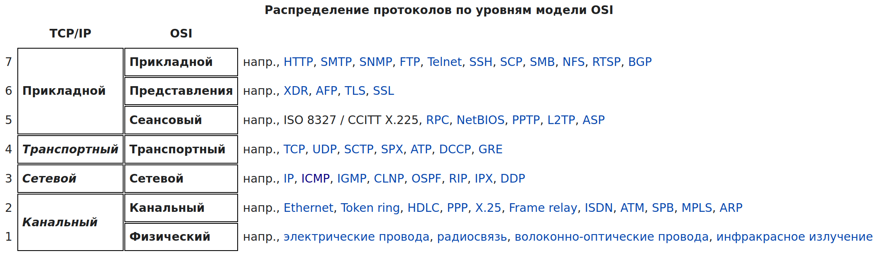
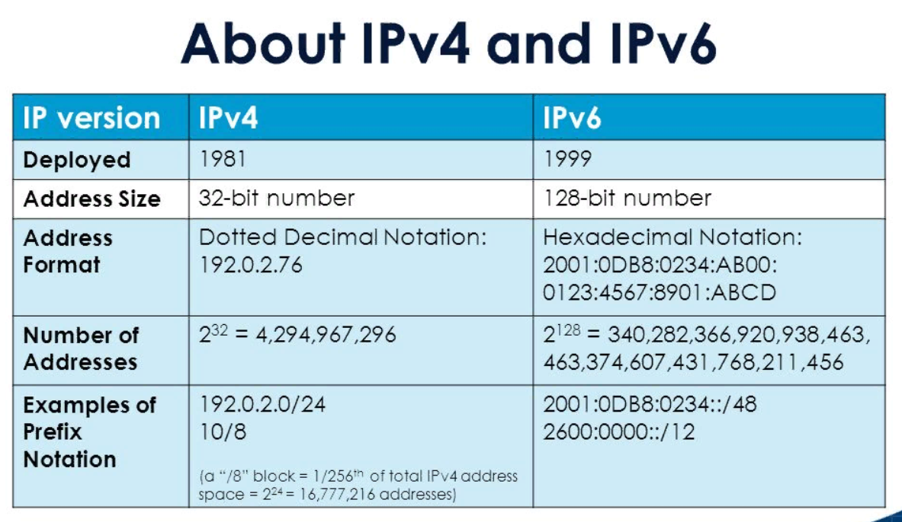
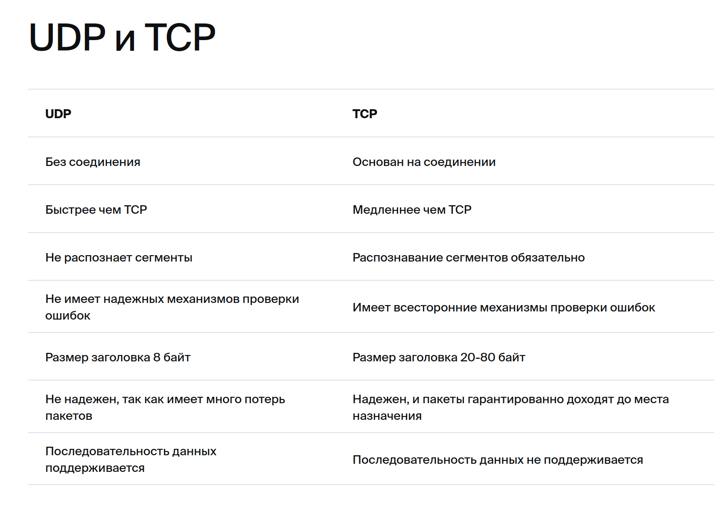

---
## Front matter
lang: ru-RU
title: Сеть в UNIX 
subtitle: Методы сетевых соединений.
author:
  - Дагделен З. Р.
institute:
  - Российский университет дружбы народов, Москва, Россия
date: 19 апреля 2024

## i18n babel
babel-lang: russian
babel-otherlangs: english

## Formatting pdf
toc: false
toc-title: Содержание
slide_level: 2
aspectratio: 169
section-titles: true
theme: metropolis
header-includes:
 - \metroset{progressbar=frametitle,sectionpage=progressbar,numbering=fraction}
 - '\makeatletter'
 - '\beamer@ignorenonframefalse'
 - '\makeatother'
---

# Информация

## Докладчик

:::::::::::::: {.columns align=center}
::: {.column width="70%"}

  * Дагделен Зейнап Реджеповна
  * студентка из группы НКАбд-02-23
  * Факультет физико-математических и естественных наук
  * Российский университет дружбы народов
  * [1132236052@rudn.ru](mailto:1132236052@rudn.ru)
  * <https:///zrdagdelen.github.io>

:::
::: {.column width="30%"}

:::
::::::::::::::

## Актуальность темы: 

В связи с распространением сетевых технологий, исследование и разработка новых методов сетевых соединений в UNIX-системах остается актуальной темой. 

## Объект и предмет исследования: 

Объектом исследования являются методы сетевых соединений в операционных системах семейства UNIX. Предметом исследования является анализ существующих методов и их сравнение. 

## Научная новизна и цель: 

Научная новизна и цель заключается в анализе существующих методов и их сравнении с новыми разработками. 

## Практическая значимость работы: 

Практическая значимость работы заключается в возможности применения разработанных методов сетевых соединений в реальных сетевых системах, что позволит улучшить эффективность взаимодействия между устройствами и программами в сети. 

## Основные методы сетевых соединений в Unix: 1. Сокеты (Sockets)

Сокет - это абстракция сетевого взаимодействия в операционной системе Linux. Каждому сокету соответствует пара IP-адрес + номер порта.   Верное название этой имплементации - "Интернет сокет". 

## Основные методы сетевых соединений в Unix: 1. Сокеты (Sockets)

В ядре ОС Linux сокеты представлены тремя основными структурами:

1. [struct socket](https://github.com/torvalds/linux/blob/d635a69dd4981cc51f90293f5f64268620ed1565/include/linux/net.h#L116) - представление сокета BSD, того вида сокета, который стал основой для современных "Интернет сокетов";
    
2. [struct sock](https://github.com/torvalds/linux/blob/75439bc439e0f02903b48efce84876ca92da97bd/include/net/sock.h#L349) - собственная оболочка, которая в Linux называется "INET socket";
    
3. [struct sk_buff](https://github.com/torvalds/linux/blob/e8c13a6bc8ebbef7bd099ec1061633d1c9c94d5b/include/linux/skbuff.h#L714) - "хранилище" данных, которые передает или получает сокет;

## Основные методы сетевых соединений в Unix: 2. Протоколы сетевого уровня

Протоколы предоставляют основу для передачи данных через сеть и определяют правила взаимодействия между устройствами.

{#fig:001 width=70%}

## 2. Протоколы сетевого уровня: IPv4

Вот некоторые из наиболее распространенных протоколов сетевого уровня:

**1. IPv4 (Internet Protocol version 4)**: Это один из основных протоколов сетевого уровня, используемый для маршрутизации пакетов данных в Интернете. IPv4 использует 32-битные адреса и является основой для большинства сетевых коммуникаций. 

## 2. Протоколы сетевого уровня: IPv4

_Как работает_? Обмен информацией в рамках этого протокола происходит с помощью технологии TCP/IP. Это означает, что каждому устройству для доступа в сеть присваивается уникальный адрес. Это позволяет обеспечивать надежный обмен данными благодаря гарантированной идентификации каждого устройства[^3^](https://vpsville.ru/blog/ipv4-adres/). 

## 2. Протоколы сетевого уровня: IPv4
    	
 _Минусы_: Количество адресов, созданных с его помощью, не может превысить цифру 4 294 967 296 (минимальный адрес - 0.0.0.0, максимальный - 255.255.255.255). С учетом того, что население земного шара составляет более семи миллиардов человек, а количество всевозможных сетевых устройств растет ежедневно, предельный порог довольно близок[^4^](https://timeweb.com/ru/community/articles/protokol-ipv4-chto-eto-takoe-i-kak-on-rabotaet).

## 2. Протоколы сетевого уровня: IPv6

**2. IPv6 (Internet Protocol version 6):** IPv6 разработан как следующее поколение протокола IPv4. Он использует 128-битные адреса, что позволяет создавать значительно больше уникальных адресов и решает проблему исчерпания адресного пространства IPv4.
	
{#fig:002 width=70%}

## 2. Протоколы сетевого уровня: IPv6
	
*Дополнительные преимущества протокола IPv6* [^5^](https://timeweb.com/ru/community/articles/protokol-ipv6-chto-eto-takoe-i-kak-on-rabotaet): По сравнению с четвертой версией, в протоколе TCP/IPv6 реализован ряд дополнительных функциональных возможностей: 

- используется более простой заголовок, из него исключены несущественные параметры, что снижает нагрузку на маршрутизаторы при обработке сетевых запросов;
- более высокий уровень обеспечения безопасности, аутентификации и конфиденциальности, которые положены в основу данной технологии;
- в протоколе реализована функция Quality of Service (QoS), позволяющая определять чувствительные к задержке пакеты;
	
## 2. Протоколы сетевого уровня: ICMP
	
**3. ICMP (Internet Control Message Protocol)**: Этот протокол используется для передачи сообщений об ошибках и управления сетью. ICMP используется для проверки доступности узлов в сети с помощью утилиты ping, а также для обнаружения ошибок при передаче данных.

*Минусы*[^6^](https://cqr.company/ru/wiki/protocols/internet-control-message-protocol-icmp/): На самом деле, с помощью ICMP можно провести атаки на сеть.

## 2. Протоколы сетевого уровня: TCP
	
**4. TCP (Transmission Control Protocol)**: TCP является протоколом, обеспечивающим надежную и упорядоченную передачу данных между узлами в сети. Он обеспечивает управление потоком данных, контроль ошибок и механизмы восстановления после сбоев.

## 2. Протоколы сетевого уровня: UDP

**5. UDP (User Datagram Protocol)**: В отличие от TCP, UDP является протоколом без установления соединения, что делает его более быстрым и менее надежным. Он широко используется для передачи потоковых данных и приложений, где скорость важнее надежности.
	
{#fig:003 width=70%}

# Заключение

Методы сетевых соединений в Unix играют ключевую роль в современных сетевых средах, обеспечивая надежную и эффективную передачу данных между узлами. Понимание этих методов является важным для администраторов систем и разработчиков, работающих в Unix-среде.

# Список литературы
1. [Сеть: Настройка и администрирование системы^0^](https://docs.altlinux.org/ru-RU/archive/2.4/html-single/master/alt-docs-master/ch06s05.html)
2. [Unix. Сетевые возможности^1^](https://acm.bsu.by/wiki/Unix2018/%D0%A1%D0%B5%D1%82%D0%B5%D0%B2%D1%8B%D0%B5_%D0%B2%D0%BE%D0%B7%D0%BC%D0%BE%D0%B6%D0%BD%D0%BE%D1%81%D1%82%D0%B8)
3. [Сокеты в ОС Linux^2^](https://habr.com/ru/companies/otus/articles/539550/)
4. [Ipv4 адрес - что это^3^](https://vpsville.ru/blog/ipv4-adres/)
5. [Протокол IPv4: что это такое и как он работает^4^](https://timeweb.com/ru/community/articles/protokol-ipv4-chto-eto-takoe-i-kak-on-rabotaet)

# Список литературы

6. [Протокол IPv6: что это такое и как он работает^5^](https://timeweb.com/ru/community/articles/protokol-ipv6-chto-eto-takoe-i-kak-on-rabotaet)
7. [Протокол интернет-управляющих сообщений (ICMP)^6^](https://cqr.company/ru/wiki/protocols/internet-control-message-protocol-icmp/)
8. [TCP^7^](https://vasexperts.ru/resources/glossary/tcp/)
9. [UDP^8^](https://vasexperts.ru/resources/glossary/udp/)
10. [ARP^9^](https://vasexperts.ru/resources/glossary/arp/)

## Итоговый слайд

Благодаря этой презентации мы разобрались, какие существуют методы сетевых соединений!

