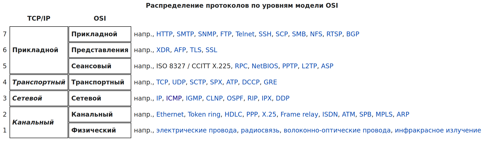
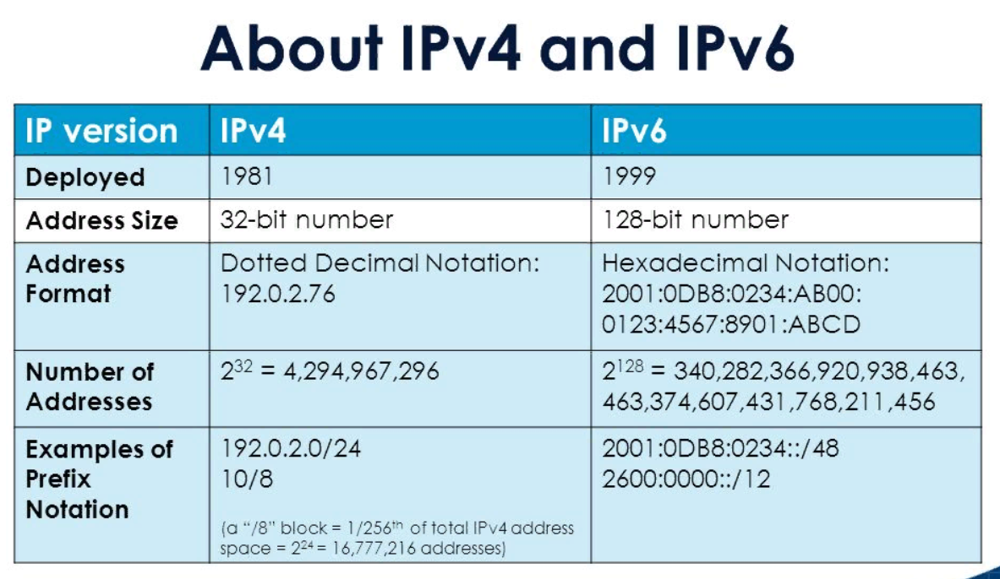
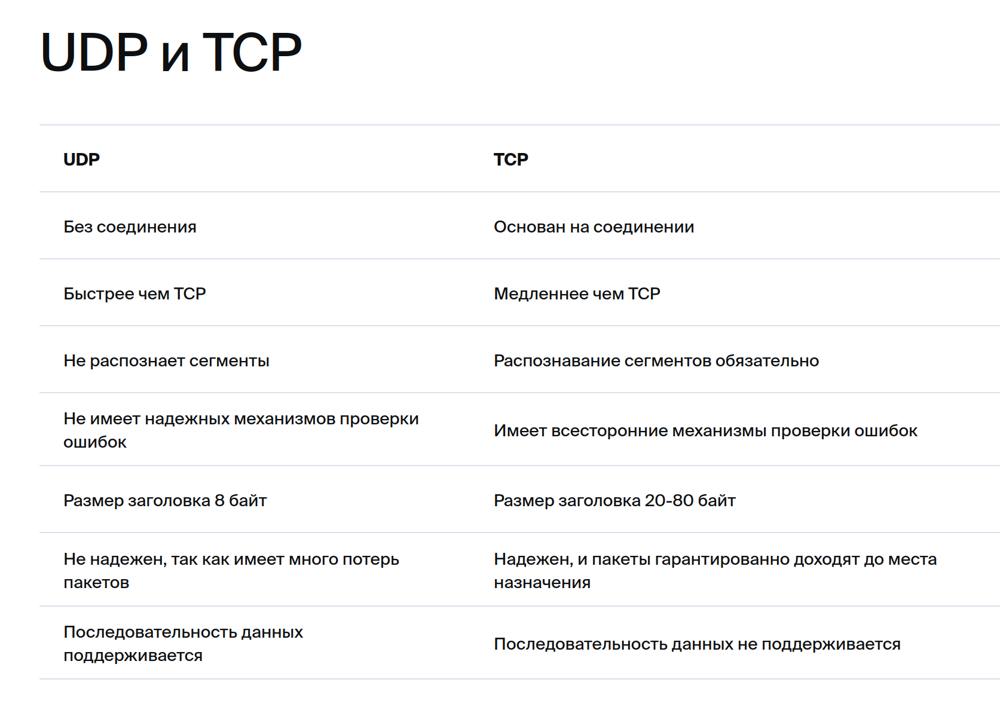

---
## Front matter
title: "Сеть в UNIX"
subtitle: "Методы сетевых соединений."
author: "Дагделен Зейнап Реджеповна"

## Generic otions
lang: ru-RU
toc-title: "Содержание"

## Bibliography
bibliography: bib/cite.bib
csl: pandoc/csl/gost-r-7-0-5-2008-numeric.csl

## Pdf output format
toc: true # Table of contents
toc-depth: 2
lof: true # List of figures
lot: true # List of tables
fontsize: 12pt
linestretch: 1.5
papersize: a4
documentclass: scrreprt
## I18n polyglossia
polyglossia-lang:
  name: russian
  options:
	- spelling=modern
	- babelshorthands=true
polyglossia-otherlangs:
  name: english
## I18n babel
babel-lang: russian
babel-otherlangs: english
## Fonts
mainfont: PT Serif
romanfont: PT Serif
sansfont: PT Sans
monofont: PT Mono
mainfontoptions: Ligatures=TeX
romanfontoptions: Ligatures=TeX
sansfontoptions: Ligatures=TeX,Scale=MatchLowercase
monofontoptions: Scale=MatchLowercase,Scale=0.9
## Biblatex
biblatex: true
biblio-style: "gost-numeric"
biblatexoptions:
  - parentracker=true
  - backend=biber
  - hyperref=auto
  - language=auto
  - autolang=other*
  - citestyle=gost-numeric
## Pandoc-crossref LaTeX customization
figureTitle: "Рис."
tableTitle: "Таблица"
listingTitle: "Листинг"
lofTitle: "Список иллюстраций"
lotTitle: "Список таблиц"
lolTitle: "Листинги"
## Misc options
indent: true
header-includes:
  - \usepackage{indentfirst}
  - \usepackage{float} # keep figures where there are in the text
  - \floatplacement{figure}{H} # keep figures where there are in the text
---
## Актуальность темы: 

В связи с распространением сетевых технологий, исследование и разработка новых методов сетевых соединений в UNIX-системах остается актуальной темой. 

## Объект и предмет исследования: 

Объектом исследования являются методы сетевых соединений в операционных системах семейства UNIX. Предметом исследования является анализ существующих методов и их сравнение. 

## Научная новизна: 

Научная новизна заключается в анализе существующих методов и их сравнении с новыми разработками. 

## Практическая значимость работы: 

Практическая значимость работы заключается в возможности применения разработанных методов сетевых соединений в реальных сетевых системах, что позволит улучшить эффективность взаимодействия между устройствами и программами в сети. 

# Введение

Современные вычислительные системы невозможно представить без наличия сетей. Операционная система UNIX почти с самого рождения интегрировала в себя технологии локальных сетей: в ней полностью реализован протокол TCP/IP (Transport Control Protocol/Internet Protocol). Протокол TCP/IP оказался наиболее успешным средством объединения компьютеров всего мира в единую сеть. Имея компьютер с системой Linux и адаптер Ethernet (сетевую карту), можно подключить компьютер к локальной сети или (при наличии соответствующего подключения) к сети Интернет, являющейся всемирной сетью, где обмен данными происходит по протоколу TCP/IP[^0^](https://docs.altlinux.org/ru-RU/archive/2.4/html-single/master/alt-docs-master/ch06s05.html). 

_Чем хорош Linux?_[^1^](https://acm.bsu.by/wiki/Unix2018/%D0%A1%D0%B5%D1%82%D0%B5%D0%B2%D1%8B%D0%B5_%D0%B2%D0%BE%D0%B7%D0%BC%D0%BE%D0%B6%D0%BD%D0%BE%D1%81%D1%82%D0%B8) 
1. Высокая стабильность. Система может работать годами без перезагрузок. 

2. Гибкость настройки. Можно выключить всё лишнее, например GUI. Можно выбрать любую ФС в зависимости от задач. 

3. Производительность. Можно перекомпилировать ядро под конкретное железо, чтобы использовать все оптимизации под имеющийся процессор. 

4. Безопасность. Исходники открыты, теоретически это должно способствовать тому, что сообщество будет находить и исправлять ошибки. На практике можно вспомнить уязвимость Heartbleed (CVE-2014-0160) в библиотеке OpenSSL, которая существовала в коде с конца 2011 и была публично объявлена в апреле 2014. 

5. Малое количество вирусов и прочего malware. Для серверов это не столь актуально, если администратор следит, какой софт выполняется на сервере, и не запускает неизвестное ПО. 

6. Бесплатность. Становится особенно важно, если в компании много серверов. Так, цена лицензии Windows Server 2016 Standard для 16-ядерного сервера составляет $882. 

7. Большое количество разнообразного серверного ПО также бесплатно. Windows-версии того же софта если и есть, то хуже оптимизированы (например nginx). 

8. Популярность. На серверах большая доля, значит, много документации, инструкций, ответов на Stackoverflow, баги репортятся и исправляются... 
       
# Основные методы сетевых соединений в Unix

## 1. Сокеты (Sockets)

Сокеты представляют собой стандартный механизм для обмена данными между процессами через сеть. В Unix они представлены как файловые дескрипторы, что позволяет использовать стандартные системные вызовы для работы с ними. Сокеты могут быть как потоковыми (TCP), так и дейтаграммными (UDP), что делает их универсальным средством для разработки сетевых приложений.

По сути, сокет - это абстракция сетевого взаимодействия в операционной системе Linux. Каждому сокету соответствует пара IP-адрес + номер порта.  Поскольку сокет является только лишь абстракцией, то связка IP-адрес + номер порта - это уже имплементация в ОС. Верное название этой имплементации - "Интернет сокет". Абстракция используется для того, чтобы операционная система могла работать с любым типом канала передачи данных. Именно поэтому в ОС Linux Интернет сокет - это дескриптор, с которым система работает как с файлом. Типов сокетов, конечно же, намного больше. 

В ядре ОС Linux сокеты представлены тремя основными структурами:

1. [struct socket](https://github.com/torvalds/linux/blob/d635a69dd4981cc51f90293f5f64268620ed1565/include/linux/net.h#L116) - представление сокета BSD, того вида сокета, который стал основой для современных "Интернет сокетов";
    
2. [struct sock](https://github.com/torvalds/linux/blob/75439bc439e0f02903b48efce84876ca92da97bd/include/net/sock.h#L349) - собственная оболочка, которая в Linux называется "INET socket";
    
3. [struct sk_buff](https://github.com/torvalds/linux/blob/e8c13a6bc8ebbef7bd099ec1061633d1c9c94d5b/include/linux/skbuff.h#L714) - "хранилище" данных, которые передает или получает сокет;
    
Если посмотреть на исходные коды, то все структуры достаточно объемны. Работа с ними возможна при использовании языка программирования или специальных оберток и написания приложения. Для эффективного управления этими структурами нужно знать, какие типы операций над сокетами существуют и когда их применять. Для сокетов существует набор стандартных действий:

- socket - создание сокета;
- bind - действие используется на стороне сервера. В стандартных терминах - это открытие порта на прослушивание, используя указанный интерфейс;
- listen - используется для перевода сокета в прослушивающее состояние. Применяется к серверному сокету;
- connect - используется для инициализации соединения;
- accept - используется сервером, создает новое соединение для клиента;
- send/recv - используется для работы с отправкой/приемом данных;
- close - разрыв соединения, уничтожение сокета.

Если о структурах, которые описаны выше, заботится ядро операционной системы, то в случае команд по управлению соединением ответственность берет на себя приложение, которое хочет пересылать данные по сети. Попробуем использовать знания о сокетах для работы с приложениями netcat и socat.[^2^](https://habr.com/ru/companies/otus/articles/539550/)

## 2. Протоколы сетевого уровня

Unix поддерживает широкий спектр сетевых протоколов, включая IPv4, IPv6, ICMP, TCP, UDP (стек протоколов TCP/IP) и другие. Эти протоколы предоставляют основу для передачи данных через сеть и определяют правила взаимодействия между устройствами.

{#fig:001 width=70%}

В Unix-подобных операционных системах поддерживаются различные протоколы сетевого уровня, каждый из которых имеет свои особенности и предназначение. Вот некоторые из наиболее распространенных протоколов сетевого уровня:

**1. IPv4 (Internet Protocol version 4)**: Это один из основных протоколов сетевого уровня, используемый для маршрутизации пакетов данных в Интернете. IPv4 использует 32-битные адреса и является основой для большинства сетевых коммуникаций. 

_История_: Протокол ipv4 впервые появился в середине 90-х годов прошлого века. Он применялся в новой на то время сети передачи данных под названием ARPANET. Именно она считается прообразом Интернета в его современном виде[^3^](https://vpsville.ru/blog/ipv4-adres/). 

_Как работает_? Обмен информацией в рамках этого протокола происходит с помощью технологии TCP/IP. Это означает, что каждому устройству для доступа в сеть присваивается уникальный адрес. Это позволяет обеспечивать надежный обмен данными благодаря гарантированной идентификации каждого устройства[^3^](https://vpsville.ru/blog/ipv4-adres/). 

_Режимы адресации протокола версии IPv4. Протокол IPv4 поддерживает три режима адресации_[^4^](https://timeweb.com/ru/community/articles/protokol-ipv4-chto-eto-takoe-i-kak-on-rabotaet):
    	1. *Одноадресный*. При использовании данного режима данные передаются только на один сетевой узел, причем каждый из них может являться как отправителем, так и получателем. Поле адреса назначения содержит 32-битный IP-адрес устройства-получателя. Одноадресный режим используется чаще всего при обращении к интернет-протоколу. 
    	2. *Широковещательный*. При его использовании все устройства, подключенные к сети с множественным доступом, имеют возможность получения и обработки датаграмм, передаваемых по протоколу TCP/IPv4. Для этого поле ip-адреса назначения включает в себя специальный широковещательный код идентификации. 
    	3. *Многоадресный*. Согласно правилам обработки данных по протоколу IPv4, сюда входят адреса в диапазоне от 224.0.0.0 до 239.255.255.255. Режим объединяет два предыдущих, определяется наиболее значимой моделью 1110. В этом пакете адрес назначения содержит специальный код, который начинается с 224.x.x.x и может использоваться более чем одним узлом.
    	
 _Минусы_: При всех своих достоинствах протокол интернета IPv4 имеет один критичный недостаток. Количество адресов, созданных с его помощью, не может превысить цифру 4 294 967 296 (минимальный адрес - 0.0.0.0, максимальный - 255.255.255.255). С учетом того, что население земного шара составляет более семи миллиардов человек, а количество всевозможных сетевых устройств растет ежедневно, предельный порог довольно близок. Согласно прогнозу RIPE NCC, в ближайшее время компаниям придется перекупать IP-адреса или ждать, когда они появятся в свободном доступе. Стоимость одного IP-адреса может составить $12-18, при этом минимальный пакет должен состоять не меньше чем из 256 адресов[^4^](https://timeweb.com/ru/community/articles/protokol-ipv4-chto-eto-takoe-i-kak-on-rabotaet).

**2. IPv6 (Internet Protocol version 6):** IPv6 разработан как следующее поколение протокола IPv4. Он использует 128-битные адреса, что позволяет создавать значительно больше уникальных адресов и решает проблему исчерпания адресного пространства IPv4.
	
{#fig:002 width=70%}
	
*Дополнительные преимущества протокола IPv6* [^5^](https://timeweb.com/ru/community/articles/protokol-ipv6-chto-eto-takoe-i-kak-on-rabotaet): По сравнению с четвертой версией, в протоколе TCP/IPv6 реализован ряд дополнительных функциональных возможностей: 

- используется более простой заголовок, из него исключены несущественные параметры, что снижает нагрузку на маршрутизаторы при обработке сетевых запросов;
- более высокий уровень обеспечения безопасности, аутентификации и конфиденциальности, которые положены в основу данной технологии;
- в протоколе реализована функция Quality of Service (QoS), позволяющая определять чувствительные к задержке пакеты;
- при передаче широковещательных пакетов используются многоадресные группы;
- для реализации технологии мультивещания в IPv6 задействовано встроенное адресное пространство FF00::/8;
- для повышения безопасности используется поддержка стандарта шифрования IPsec, который позволяет шифровать данные без необходимости какой-либо поддержки со стороны прикладного ПО.
	
**3. ICMP (Internet Control Message Protocol)**: Этот протокол используется для передачи сообщений об ошибках и управления сетью. ICMP используется для проверки доступности узлов в сети с помощью утилиты ping, а также для обнаружения ошибок при передаче данных.

*Минусы*[^6^](https://cqr.company/ru/wiki/protocols/internet-control-message-protocol-icmp/): На самом деле, с помощью ICMP можно провести атаки на сеть.

- Ping Flood Attack: Эта атака включает в себя отправку большого количества эхо-запросов ICMP в целевую систему, в результате чего она перестает отвечать на законный трафик.
- Ping of Death Attack: Эта атака включает в себя отправку слишком большого ICMP-пакета в целевую систему, что приводит к ее сбою или нестабильности.
- Smurf Attack: Эта атака включает отправку большого количества эхо-запросов ICMP на широковещательный адрес сети, в результате чего все хосты в сети отвечают эхо-ответами ICMP целевой системе, перегружая ее трафиком.
	
**4. TCP (Transmission Control Protocol)**: TCP является протоколом, обеспечивающим надежную и упорядоченную передачу данных между узлами в сети. Он обеспечивает управление потоком данных, контроль ошибок и механизмы восстановления после сбоев.

Протокол распространен в соединениях, работающих по IP, и иногда называется TCP/IP.

TCP и IP отличаются в том смысле, что основная роль IP заключается в поиске адреса, на который будут доставлены данные, а TCP — это канал, по которому передается сообщение.

*История*[^7^](https://vasexperts.ru/resources/glossary/tcp/): Протокол был создан в 1973 году, но потребовалось еще 8 лет, чтобы завершить его стандартизацию.

*Особенности TCP*[^7^](https://vasexperts.ru/resources/glossary/tcp/):

- Ориентированный на соединение 
- С открытым исходным кодом 
- Обеспечивает доставку данных по назначению в неизменном виде 
- Обеспечивает качество обслуживания и управление потоком 
- Работает в режиме клиент/сервер точка-точка 
- Он может выполнять функции как отправителя, так и получателя 
- Механизм проверки и восстановления ошибок встроен в протокол 
- Поддерживается сквозная связь

TCP очень важен при определении того, как осуществляется коммуникация в Интернете. Он является одним из фундаментов, на которых построен Интернет, и благодаря TCP передача данных осуществляется безупречно из любой точки мира и в любое время. Его гибкость и масштабируемость также позволяют внедрять новые стандарты.

**5. UDP (User Datagram Protocol)**: В отличие от TCP, UDP является протоколом без установления соединения, что делает его более быстрым и менее надежным. Он широко используется для передачи потоковых данных и приложений, где скорость важнее надежности.
	
{#fig:003 width=70%}

UDP использует минимальное количество механизмов, предоставляя контрольные суммы для обеспечения целостности данных и номера портов для обеспечения других функциональных возможностей и назначения datagram[^8^](https://vasexperts.ru/resources/glossary/udp/).

**6. ARP (Address Resolution Protocol):** ARP используется для определения MAC-адреса устройства по его IP-адресу в локальной сети.
	
*Как это работает*[^9^](https://vasexperts.ru/resources/glossary/arp/): Вот распространенный сценарий использования ARP: два компьютера находятся в одной сети Ethernet, у них есть IP-адреса друг друга, но MAC-адреса неизвестны. Однако сеть Ethernet не может передавать данные на основе IP-адресов.

Для решения проблемы один из компьютеров посылает широковещательный запрос с нужным IP-адресом всем хостам в том же домене. Компьютер с нужным IP-адресом, в свою очередь, отвечает своим MAC-адресом. Это обеспечивает передачу данных.

# Заключение

Методы сетевых соединений в Unix играют ключевую роль в современных сетевых средах, обеспечивая надежную и эффективную передачу данных между узлами. Понимание этих методов является важным для администраторов систем и разработчиков, работающих в Unix-среде.

# Список литературы
1. [Сеть: Настройка и администрирование системы^0^](https://docs.altlinux.org/ru-RU/archive/2.4/html-single/master/alt-docs-master/ch06s05.html)
2. [Unix. Сетевые возможности^1^](https://acm.bsu.by/wiki/Unix2018/%D0%A1%D0%B5%D1%82%D0%B5%D0%B2%D1%8B%D0%B5_%D0%B2%D0%BE%D0%B7%D0%BC%D0%BE%D0%B6%D0%BD%D0%BE%D1%81%D1%82%D0%B8)
3. [Сокеты в ОС Linux^2^](https://habr.com/ru/companies/otus/articles/539550/)
4. [Ipv4 адрес - что это^3^](https://vpsville.ru/blog/ipv4-adres/)
5. [Протокол IPv4: что это такое и как он работает^4^](https://timeweb.com/ru/community/articles/protokol-ipv4-chto-eto-takoe-i-kak-on-rabotaet)
6. [Протокол IPv6: что это такое и как он работает^5^](https://timeweb.com/ru/community/articles/protokol-ipv6-chto-eto-takoe-i-kak-on-rabotaet)
7. [Протокол интернет-управляющих сообщений (ICMP)^6^](https://cqr.company/ru/wiki/protocols/internet-control-message-protocol-icmp/)
8. [TCP^7^](https://vasexperts.ru/resources/glossary/tcp/)
9. [UDP^8^](https://vasexperts.ru/resources/glossary/udp/)
10. [ARP^9^](https://vasexperts.ru/resources/glossary/arp/)
